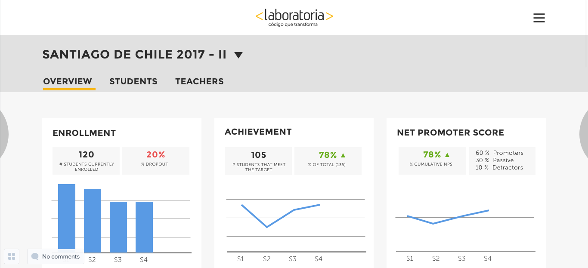
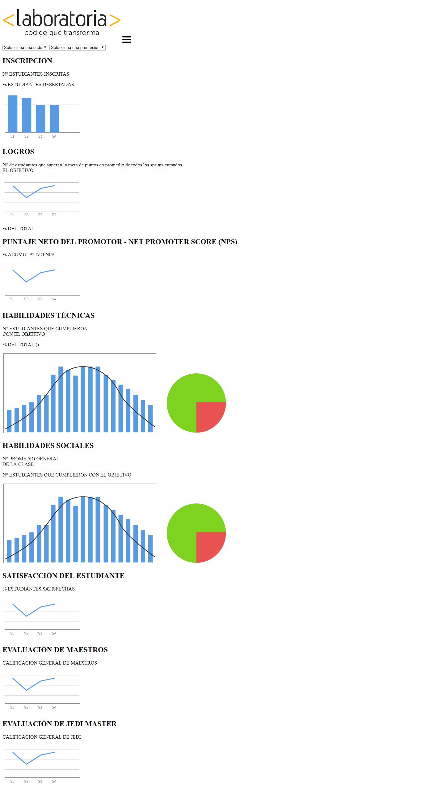
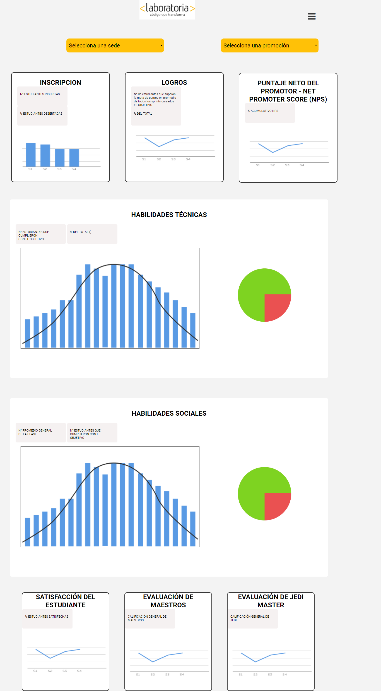

### Proyecto: "Data-Dashboard" ###

--------------------------------------------------------------

1) __OBJETIVO__

  Para este proyecto nos indican que debemos construir una herramienta web que nos permite verificar tyoda la información respecto del desempeño de las estudiantes de laboratoria donde se pueda acceder a los siguientes datos de forma fácil y rápida:

  * El total de estudiantes presentes por sede y generación.
  * El porcentaje de deserción de estudiantes.
  * La cantidad de estudiantes que superan la meta de puntos en promedio de todos los sprints cursados. La meta de puntos es 70% del total de puntos en HSE y en tech.

  * El porcentaje que representa el dato anterior en relación al total de estudiantes.

  * El Net Promoter Score (NPS) promedio de los sprints cursados. El NPS se calcula en base a la encuesta que las estudiantes responden al respecto de la recomendación que darían de Laboratoria, bajo la siguiente fórmula:

  [Promoters] = [Respuestas 9 o 10] / [Total respuestas] * 100
  [Passive] = [Respuestas 7 u 8] / [Total respuestas] * 100
  [Detractors] = [Respuestas entre 1 y 6] / [Total respuestas] * 100

  [NPS] = [Promoters] - [Detractors]

  * La cantidad y el porcentaje que representa el total de estudiantes que superan la meta de puntos técnicos en promedio y por sprint.

  * La cantidad y el porcentaje que representa el total de estudiantes que superan la meta de puntos de HSE en promedio y por sprint.

  * El porcentaje de estudiantes satisfechas con la experiencia de Laboratoria.

  * La puntuación promedio de los profesores.

  * La puntuación promedio de los jedi masters.

 De manera que nos quede similar a la siguiente imagen:

  

2) __DESARROLLO__

  2.1 *Primera Parte*

  Primero realizamos la estructura html, para hacerlo más factible lo divididimos en tres secciones, la primera de ellas es el header(donde se encuentra el logo y el ícono), luego tenemos la parte principal donde se encuentran los selectores que podrán ser manejados por los TMs dependiendo a la información a la que quieran acceder(filtrar), agrupamos la siguiente información en articulos , agregamos los textos corrspondientes a las funciones pedidas a su vez añadimos las imágenes de gráficas.

   En la siguiente imagen se muestra solo la estructura html:

  

  2.2 *Segunda Parte*

  Básicamente en esta parte ordenamos la información con css por lo que comienzo con el header (logo más ícono centrados),en la siguiente sección se encuentran los selectores al cual se le da color,tamaño,etc.En la tercera sección como ya están nombrados por sus respectivas clases hacemos los cambios necesarios como margen para la alineación, el color: blanco para los article y color tipo gris para los box y hasta el momento obtenemos lo siguiente:

  

  2.1.3 *Tercera Sección*

  En esta parte nos encargaremos de ingresar las funciones pedidas en javascript y proximamente hacerlas funcionar
  

3) __INTEGRANTES:__

* Flor Mily Quispe Yura
* Alejandra Cabrera
