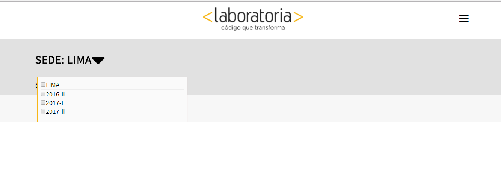
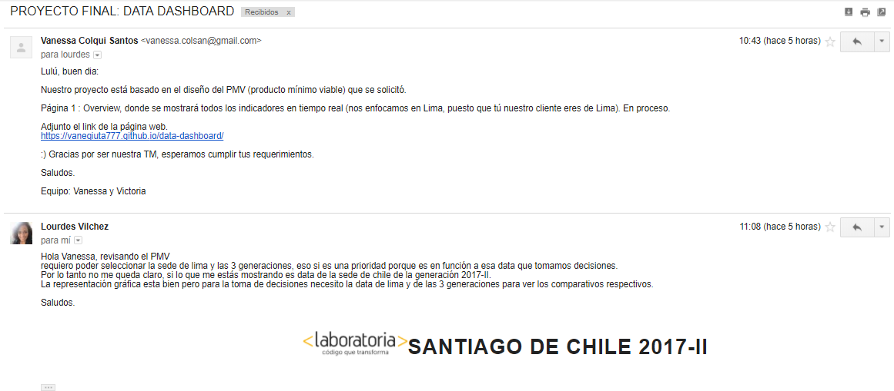

# "DATA DASHBOARD"

## PROYECTO FINAL

### DESCRIPCION

Es una representación gráfica de los principales indicadores (KPI) que intervienen en la consecución de los objetivos de negocio, y que está orientada a la toma de decisiones para optimizar la estrategia de la empresa.
Un dashboard debe transformar los datos en información y esta en conocimiento para el negocio.

### OBJETIVOS

Lograr:

* El total de estudiantes presentes por sede y generación.
* El porcentaje de deserción de estudiantes.
* La cantidad de estudiantes que superan la meta de puntos en promedio de todos los sprints cursados.
* El porcentaje que representa el dato anterior en relación al total de estudiantes.
* El Net Promoter Score (NPS) promedio de los sprints cursados.
* La cantidad y el porcentaje que representa el total de estudiantes que superan la meta de puntos técnicos en promedio y por sprint.
* La cantidad y el porcentaje que representa el total de estudiantes que superan la meta de puntos de HSE en promedio y por sprint.
* El porcentaje de estudiantes satisfechas con la experiencia de Laboratoria.
* La puntuación promedio de l@s profesores.
* La puntuación promedio de l@s jedi masters.

### DESARROLLO

#### PARTE 1

* Se identifican los objetivos a lograr (requerimientos del Training Manager, sede Lima) y las actividades a realizar, nos dividimos tareas pendientes: maquetado y estilos, funcionalidad, y necesidades del cliente.

#### PARTE 2

* Se crea una rama del gitHub por cada colaboradora para subir nuestros cambios a la rama master, a través del comando merge.
* Maquetación y diseño de las páginas.
* Se realiza la funcionalidad de los eventos mediante javascript.

### PARTE 3

* Se envía un correo al Training Manager (Lulú Vilchez), con los avances para sus comentarios. Se adjunta capturas de pantalla del avance del proyecto.

### PARTE 4

* Se recibe feedback de nuestro Training Manager (Lulú Vilchez); quien solicita seleccionar la sede de lima y las 3 generaciones, para la toma de decisiones.

### PARTE 5

* Se corrige lo solicitado por el Training Manager.

Colaboradoras:

* L. Vanessa Colqui Santos.
* Victoria Lung Hinostroza