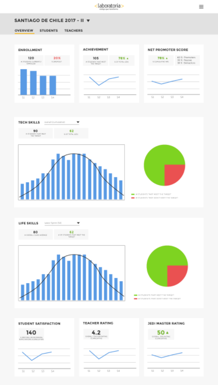
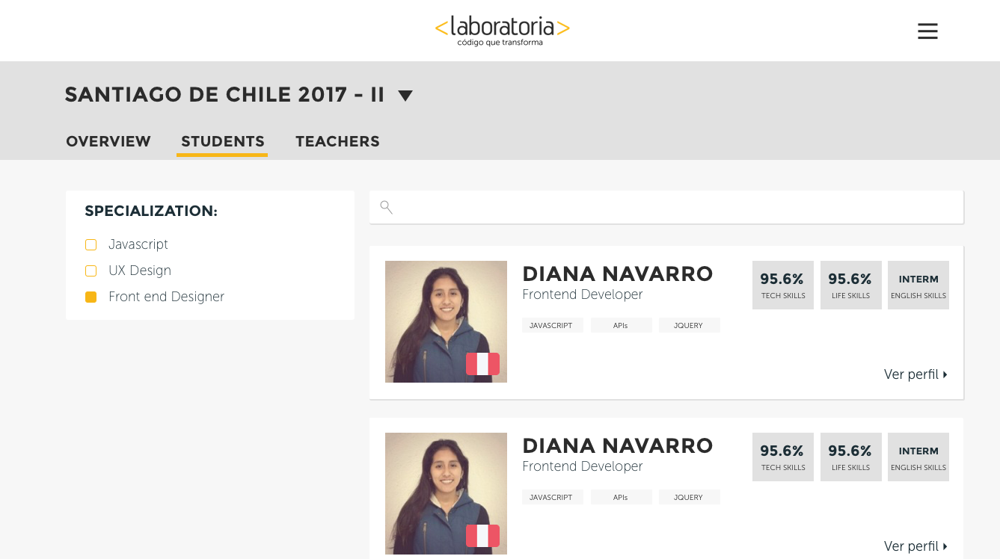

# Producto Final
## Resúmen del Producto 
> En Laboratoria, las Training Managers (TMs) hacen un gran trabajo al analizar la mayor cantidad de datos posibles respecto al desempeño de las estudiantes para apoyarlas en su aprendizaje. Para revisar esta data, las TMs, normalmente, tienen que revisar muchos documentos de excel (Google Spreadsheets) que están localizados en distintas carpetas y ubicaciones. Muchas veces pierden tiempo localizando estos documentos y ejecutando fórmulas para obtener los datos que necesitan.

## Requerimientos del usuario
> * El total de estudiantes presentes por sede y generación.
> * El porcentaje de deserción de estudiantes.
> * La cantidad de estudiantes que superan la meta de puntos en promedio de todos los sprints cursados. La meta de puntos es 70% del total de puntos en HSE y en tech.
> * El porcentaje que representa el dato anterior en relación al total de estudiantes.
> * El Net Promoter Score (NPS) promedio de los sprints cursados. El NPS se calcula en base a la encuesta que las estudiantes responden al respecto de la recomendación que darían de Laboratoria, bajo la siguiente fórmula:

```bash
[Promoters] = [Respuestas 9 o 10] / [Total respuestas] * 100
[Passive] = [Respuestas 7 u 8] / [Total respuestas] * 100
 [Detractors] = [Respuestas entre 1 y 6] / [Total respuestas] * 100
 [NPS] = [Promoters] - [Detractors]
```

> * La cantidad y el porcentaje que representa el total de estudiantes que superan la meta de puntos técnicos en promedio y por sprint.
> * La cantidad y el porcentaje que representa el total de estudiantes que superan la meta de puntos de HSE en promedio y por sprint.
> * El porcentaje de estudiantes satisfechas con la experiencia de Laboratoria.
> * La puntuación promedio de l@s profesores.
> * La puntuación promedio de l@s jedi masters.

## Flujo de trabajo

1. Debes realizar un [**fork**] (https://github.com/Laboratoria-learning/data-dashboard)
   de este repositorio.

2. Luego clonamos el fork en la máquina. Con el comando `git clone` y su estructura normalmente se ve así:

   ```bash
    git clone https://github.com/<nombre-de-usuario>/data-dashboard.git
   ```

3. Realizamos la estructura y diseño de la página web establecida
4. Dar funcionalidad mediante javascript.
5. Realizar `README.md` y también desplegamos la web a Github Pages 

## Herramientas 
1. HTML5
2. CSS3
3. JAVASCRIPT(Dom)

## OBJETIVO FINAL
* Se visualiza una web site donde se interactuara con una base de datos asi verificar el avanze del estudiante, las clases y calificación a los jedimaster de LABORATORIA.

 
 
 