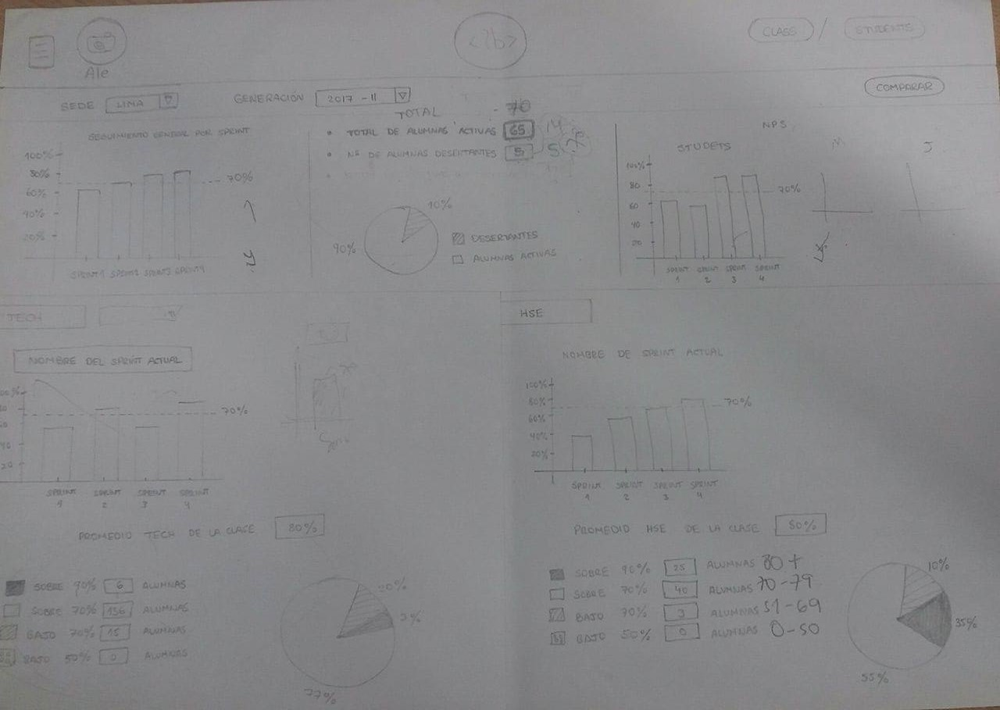

# Data Dashboard

* **Track:** _Common Core_
* **Curso:** _Creando tu primer sitio web interactivo_
* **Unidad:** _Producto final_

***

## Flujo de trabajo

1. Creamos una comunidad **BC-NELIDA-YANIRA**.
2. Se realizó un [**fork**](https://gist.github.com/ivandevp/1de47ae69a5e139a6622d78c882e1f74)
   de este repositorio.
3. Luego cada una procedió a **clonar** ese fork en su máquina respectiva.
4. Nuestro proyecto esta basado en este [**diseño**](https://marvelapp.com/104ejifg/) en combinación con nuestro primer sketch a continuación:

***
## Autores

* Nelida Sheridan Quispe Tacuri
* Yanira
