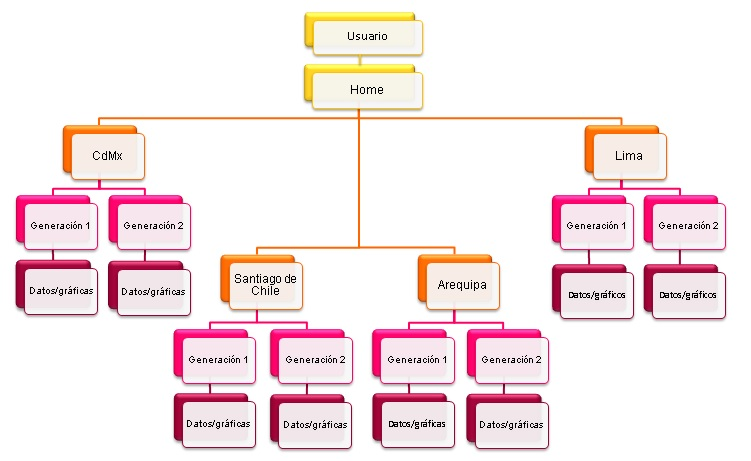
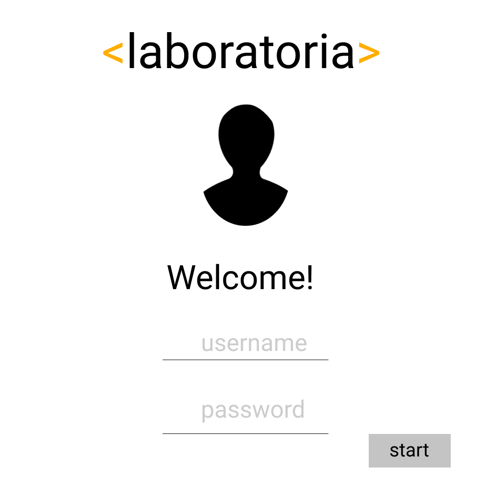
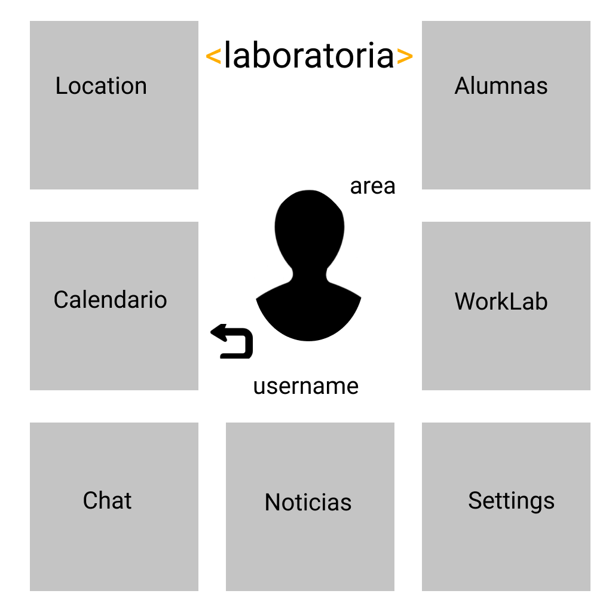
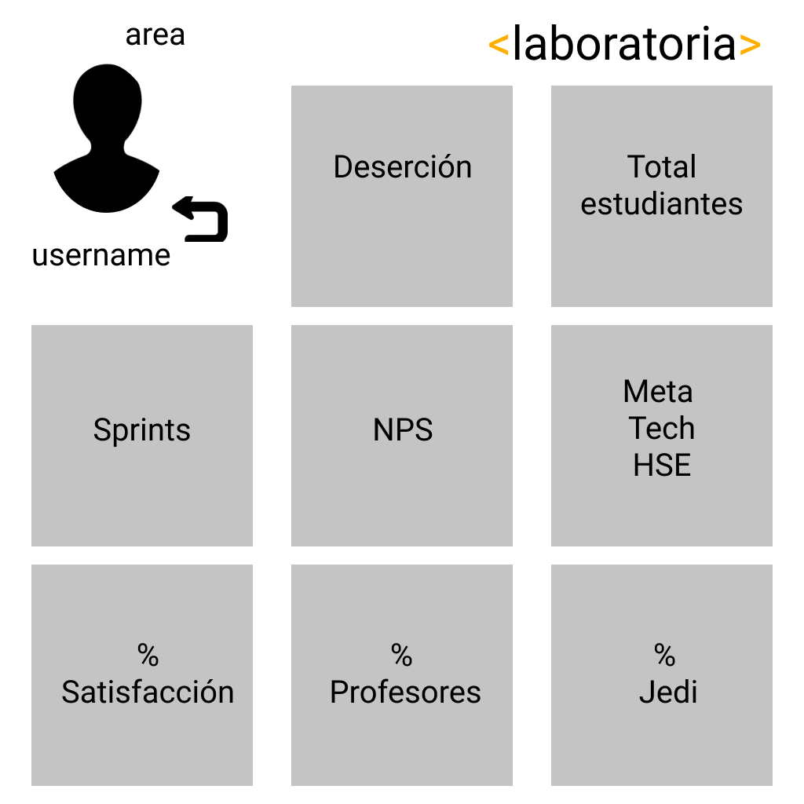
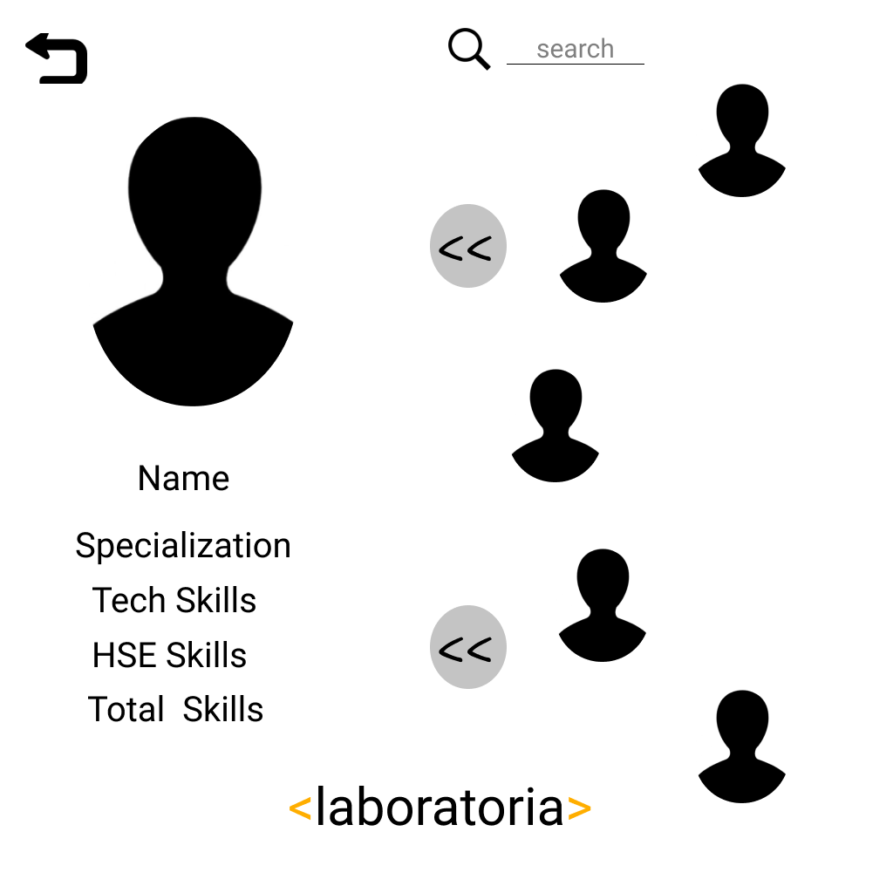
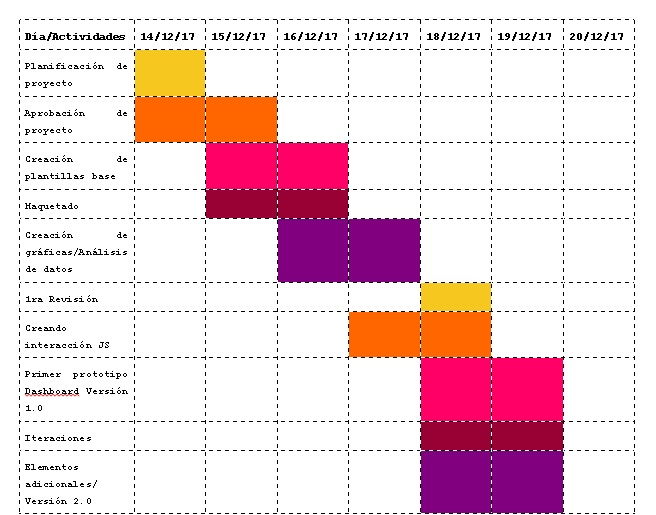
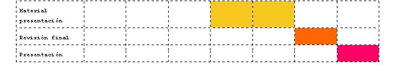
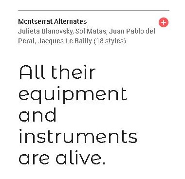

# Data Dashboard

* **Track:** _Common Core_
* **Curso:** _Creando tu primer sitio web interactivo_
* **Unidad:** _Producto final_

***

## Flujo de trabajo

1. Debes realizar un [**fork**](https://gist.github.com/ivandevp/1de47ae69a5e139a6622d78c882e1f74)
   de este repositorio.

2. Luego deberás **clonar** tu fork en tu máquina. Recuerda que el comando a usar
   es `git clone` y su estructura normalmente se ve así:

   ```bash
   git clone https://github.com/<nombre-de-usuario>/freelancer.git
   ```

3. Cuando hayas terminado tu producto, envía un Pull Request a este repositorio
   (puedes solicitar apoyo de tus profes para este paso).

> Nota: No olvides que es una buena práctica describir tu proyecto en este
> archivo `README.md` y también desplegar tu web a Github Pages :smiley:.

## PROYECTO DASHBOARD LABORATORIA
Coders:

        Jessica Itzayana Villanueva Morán

        Karla Lucero Martínez Miranda

***

## Requerimientos del cliente

Elaborar una herramienta web para la optimización de la visualización y manipulación de datos de la empresa. Esta debe cumplir con los siguientes objetivos:
- El total de estudiantes presentes por sede y generación.
-	El porcentaje de deserción de estudiantes.
-	La cantidad de estudiantes que superan la meta de puntos en promedio de todos los sprints cursados. La meta de puntos es 70% del total de puntos en HSE y en tech.
-	El porcentaje que representa el dato anterior en relación al total de estudiantes.
-	El Net Promoter Score (NPS) promedio de los sprints cursados.
-	La cantidad y el porcentaje que representa el total de estudiantes que superan la meta de puntos técnicos en promedio y por sprint.
-	La cantidad y el porcentaje que representa el total de estudiantes que superan la meta de puntos de HSE en promedio y por sprint.
-	El porcentaje de estudiantes satisfechas con la experiencia de Laboratoria.
-	La puntuación promedio de l@s profesores.
-	La puntuación promedio de l@s jedi masters.

## Propuesta Dashboard Laboratoria 1.0

Con base a lo solicitado, se creará una herramienta con las especificaciones antes mencionadas, donde el diseño y la funcionalidad son parte esencial del proyecto. Nos centraremos en una herramienta que cumpla con las siguientes características:
-	Fácil manejo y amigable con el usuario
-	Diseño atractivo para una empresa joven como Laboratoria.
-	Práctico y funcional en el acceso a los datos.

Adicional a estas premisas, se considerarán algunos elementos adicionales que puedan mejorar la herramienta como:
-	Un elemento donde se visualice los datos específicos por alumna, que nos permita observar cómo ha sido su desempeño en Laboratoria.
-	Un elemento que funcione como una herramienta de gestión de trabajo para la empresa, donde se pueda observar el flujo de trabajo interno. Estará personalizada de acuerdo con las necesidades de la empresa.
-	Un chat personalizado donde los usuarios puedan tener comunicación entre ellos de manera fácil y directa.
Estos elementos están considerados en la versión 2.0 para una mejora continua del producto.

## Diagrama de flujo – Laboratoria Dashboard


## Sketching Dashboard Laboratoria








En el siguiente link se puede observar la interacción que tendrá nuestra herramienta Dashboard:

https://marvelapp.com/29fcc2a/screen/36298566

## Cronograma de actividades



## Diseño y tipografía
Paleta de colores


## Tipografía
Títulos


Cuerpo


