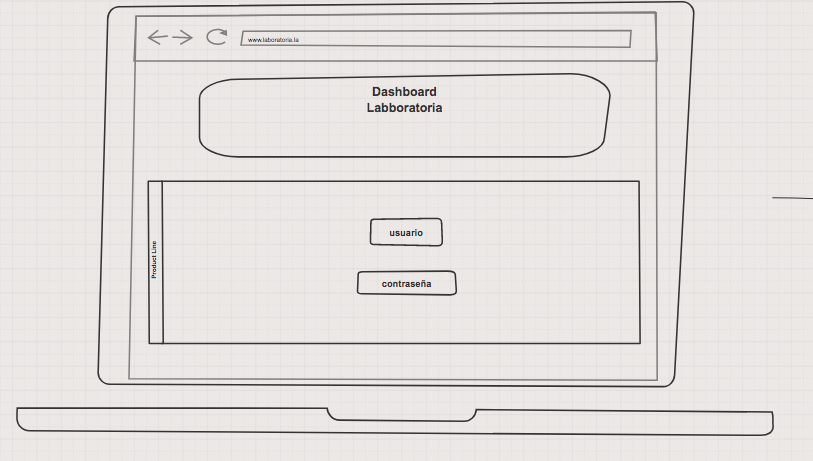
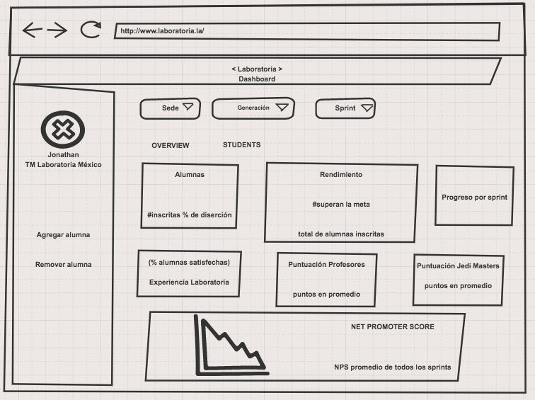
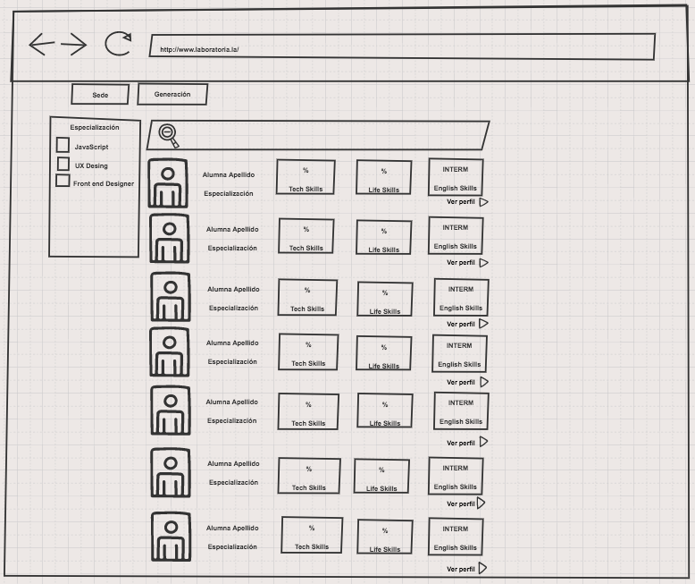
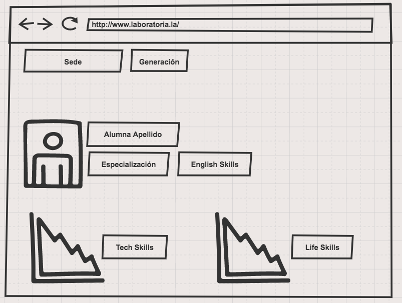

# Data Dashboard

* **Track:** _Common Core_
* **Curso:** _Creando tu primer sitio web interactivo_
* **Unidad:** _Producto final_

***

## Flujo de trabajo

1. Debes realizar un [**fork**](https://gist.github.com/ivandevp/1de47ae69a5e139a6622d78c882e1f74)
   de este repositorio.

2. Luego deberás **clonar** tu fork en tu máquina. Recuerda que el comando a usar
   es `git clone` y su estructura normalmente se ve así:

   ```bash
   git clone https://github.com/<nombre-de-usuario>/freelancer.git
   ```

3. Cuando hayas terminado tu producto, envía un Pull Request a este repositorio
   (puedes solicitar apoyo de tus profes para este paso).

> Nota: No olvides que es una buena práctica describir tu proyecto en este
> archivo `README.md` y también desplegar tu web a Github Pages :smiley:.

***

### SOBRE EL PRODUCTO
En Laboratoria, las Training Managers (TMs) hacen un gran trabajo al analizar la mayor cantidad de datos posibles respecto al desempeño de las estudiantes para apoyarlas en su aprendizaje. Para revisar esta data, las TMs, normalmente, tienen que revisar muchos documentos de excel (Google Spreadsheets) que están localizados en distintas carpetas y ubicaciones. Muchas veces pierden tiempo localizando estos documentos y ejecutando fórmulas para obtener los datos que necesitan.

Para poder optimizar su tiempo, las TMs han solicitado que construyamos una herramienta web donde puedan ver estos datos fácil y rápidamente. Y nos comentaron que estos son los datos que revisan normalmente:

- El total de estudiantes presentes por sede y generación.
- El porcentaje de deserción de estudiantes.
- La cantidad de estudiantes que superan la meta de puntos en promedio de todos los sprints cursados. La meta de puntos es 70% del total de puntos en HSE y en tech.
- El porcentaje que representa el dato anterior en relación al total de estudiantes.
- El Net Promoter Score (NPS) promedio de los sprints cursados. El NPS se calcula en base a la encuesta que las estudiantes responden al respecto de la recomendación que darían de Laboratoria, bajo la siguiente fórmula:

```bash
 [Promoters] = [Respuestas 9 o 10] / [Total respuestas] * 100
 [Passive] = [Respuestas 7 u 8] / [Total respuestas] * 100
 [Detractors] = [Respuestas entre 1 y 6] / [Total respuestas] * 100

 [NPS] = [Promoters] - [Detractors]
```

- La cantidad y el porcentaje que representa el total de estudiantes que superan la meta de puntos técnicos en promedio y por sprint.
- La cantidad y el porcentaje que representa el total de estudiantes que superan la meta de puntos de HSE en promedio y por sprint.
- El porcentaje de estudiantes satisfechas con la experiencia de Laboratoria.
- La puntuación promedio de l@s profesores.
- La puntuación promedio de l@s jedi masters.


***

# Data Dashboard

## Propuesta de diseño inicial

La estructura general para la primera pantalla del sitio puede ser pública o privada, conforme lo que tu decidas, si es pública tendría al principio un video o fotografía relacionado con el programa para que así el visitante pueda saber mas sobre el y tener una idea (si es empresa) del perfil que busca, pero si al contrario es privado cada usuario que tu nos digas podrá acceder con su e-mail y una contraseña generada automáticamente.

**Respuesta del cliente:** _Mi principal necesidad es ver la data que les pasamos de manera especificada como en los requerimientos_.

Para la segunda pantalla seria un overview que contendrá  todo lo relacionado con los promedios generales del programa como el taller de HSE, el porcentaje de alumnas inscritas, así como de deserción de estudiantes, las evaluaciones de los jedi masters y profesores, el NPS de los sprints cursados, etc.

La tercera pantalla del sitio sería el acceso a las sedes por su ubicación y con acceso a cada generación y dentro de cada generación sus estudiantes, para acceder a cada una mediante su perfil  donde se podrá ver su especialidad y sus promedios graficados.

En la última pantalla tener enlaces a blog, medios sociales, la visión de laboratoria (en caso de ser público).

### Sketch inicial

 1.- Primera pantalla

  

 2.- Segunda pantalla

  

 3.- Tercera pantalla

  

  4.- Cuarta pantalla

  

### Aclaraciones del cliente

1.- Gráficas generales para el overview.

2.- Agregar sección de teachers, con un perfil igual al de las alumnas.

### Sketch final

1.- Primera pantalla

 


2.- Segunda pantalla

 

3.-

4.-
