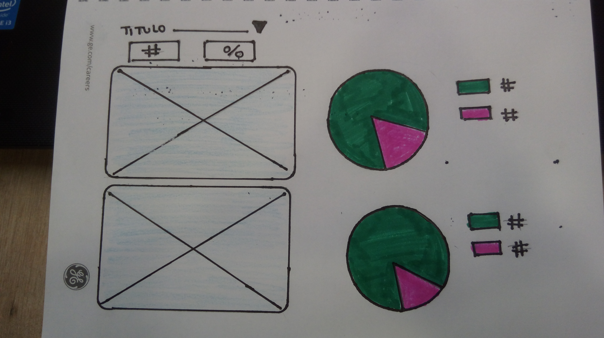
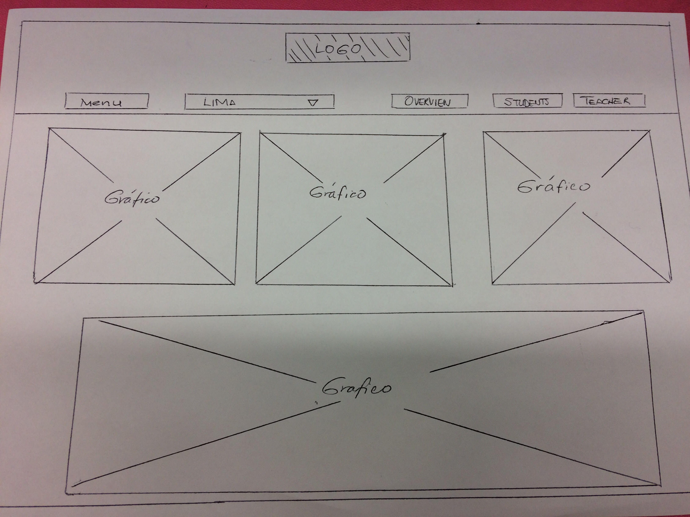

# Data Dashboard

* **Track:** _Common Core_
* **Curso:** _Creando tu primer sitio web interactivo_
* **Unidad:** _Producto final_

***

## Flujo de trabajo

1. Debes realizar un [**fork**](https://gist.github.com/ivandevp/1de47ae69a5e139a6622d78c882e1f74)
   de este repositorio.

2. Luego deberás **clonar** tu fork en tu máquina. Recuerda que el comando a usar
   es `git clone` y su estructura normalmente se ve así:

   ```bash
   git clone https://github.com/<nombre-de-usuario>/freelancer.git
   ```

3. Cuando hayas terminado tu producto, envía un Pull Request a este repositorio
   (puedes solicitar apoyo de tus profes para este paso).

> Nota: No olvides que es una buena práctica describir tu proyecto en este
> archivo `README.md` y también desplegar tu web a Github Pages :smiley:.

## DATA DASHBOARD
### Sobre el producto

En Laboratoria, las Training Managers (TMs) hacen un gran trabajo al analizar la mayor cantidad de datos posibles respecto al desempeño de las estudiantes para apoyarlas en su aprendizaje. Para revisar esta data, las TMs, normalmente, tienen que revisar muchos documentos de excel (Google Spreadsheets) que están localizados en distintas carpetas y ubicaciones. Muchas veces pierden tiempo localizando estos documentos y ejecutando fórmulas para obtener los datos que necesitan.

Para poder optimizar su tiempo, las TMs han solicitado que construyamos una herramienta web donde puedan ver estos datos fácil y rápidamente. Y nos comentaron que estos son los datos que revisan normalmente:

El total de estudiantes presentes por sede y generación.
El porcentaje de deserción de estudiantes.
La cantidad de estudiantes que superan la meta de puntos en promedio de todos los sprints cursados. La meta de puntos es 70% del total de puntos en HSE y en tech.
El porcentaje que representa el dato anterior en relación al total de estudiantes.
El Net Promoter Score (NPS) promedio de los sprints cursados. El NPS se calcula en base a la encuesta que las estudiantes responden al respecto de la recomendación que darían de Laboratoria, bajo la siguiente fórmula:

[Promoters] = [Respuestas 9 o 10] / [Total respuestas] * 100
[Passive] = [Respuestas 7 u 8] / [Total respuestas] * 100
[Detractors] = [Respuestas entre 1 y 6] / [Total respuestas] * 100

[NPS] = [Promoters] - [Detractors]
La cantidad y el porcentaje que representa el total de estudiantes que superan la meta de puntos técnicos en promedio y por sprint.
La cantidad y el porcentaje que representa el total de estudiantes que superan la meta de puntos de HSE en promedio y por sprint.
El porcentaje de estudiantes satisfechas con la experiencia de Laboratoria.
La puntuación promedio de l@s profesores.
La puntuación promedio de l@s jedi masters.
Con esa información y con la base de datos que nos facilitaron pudimos crear este diseño. Sin embargo, creemos que tú podrías proponer algún cambio a este diseño que pueda mejorar la experiencia de las TMs.

### ¿Qué se requiere?

Trabajar en parejas
Tener una planificación
La definición del diseño
Implementación del data dashboard usando html, css y js
Desplegar el producto en Github Pages

### ¿Cómo empezar?

Debes realizar un fork de este repositorio.

Luego deberás clonar tu fork en tu máquina. Recuerda que el comando a usar es git clone y su estructura normalmente se ve así:

git clone https://github.com/<nombre-de-usuario>/data-dashboard.git
Adicionales

En Laboratoria (y sobre todo las TMs) somos adictos a la representación gráfica de los datos y como muestra el diseño, sería ideal poder mostrar los datos procesados en un gráfico como el diseño propone u otra alternativa.

Nota: En la etapa de diseño de la experiencia del producto, nos dimos cuenta que Google Charts podría ser una opción para desarrollar estos gráficos, pero no es la única que se puede usar :smiley:.

Además, la proactividad (siempre de las TMs :joy:) hace que el siguiente requerimiento adicional sea muy útil:

Tener un botón que permita indicar que una estudiante ha salido del Bootcamp y alterar los totales afectados por este cambio.

#### Objetivo Funcional
Muestre la pagina cumpliendo los requerimientos de los usuarios

#### Objetivo Tecnico
Poner en practica los temas revisados en clase de laboratoria(positioning) sob re todo respecto al sprint en que nos encontramos

#### Herramientas

+ Editor Atom
    + html
    + css
+ Pagina Google charts
+ Markdown(README)
+ Hoja y papel para hacer el sketch




