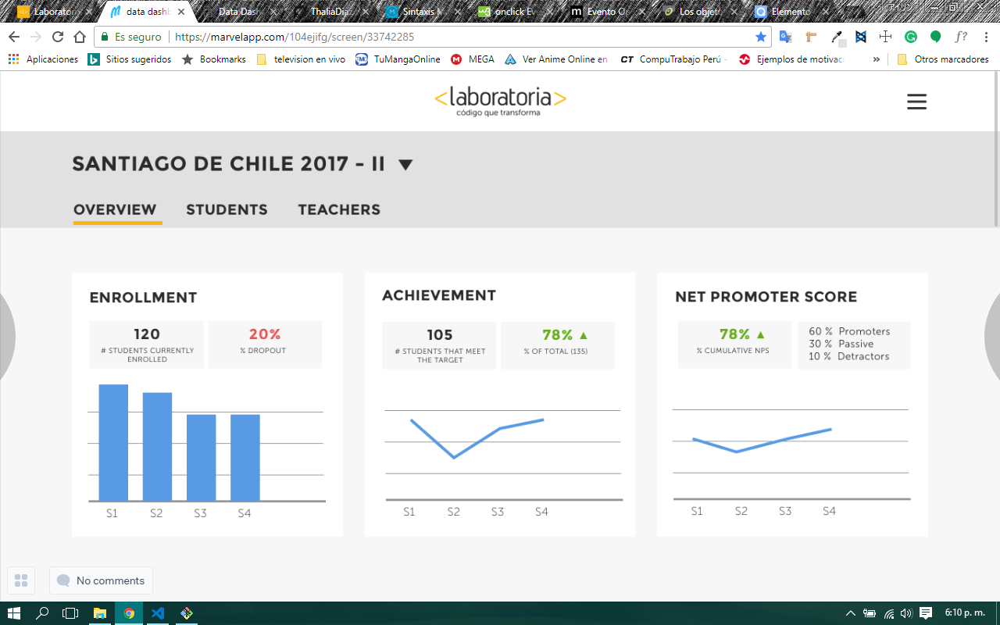

# Data Dashboard

* **Track:** _Common Core_
* **Curso:** _Creando tu primer sitio web interactivo_
* **Unidad:** _Producto final_
* **Colaboradores del Proyecto:** _Thalia Diaz y Aylin Espichan_

***

## Flujo de trabajo

1. Es importante para nuestro cliente poder optimizar el tiempo de procesamiento de data, sobre todo si maneja importante data para esta. Hemos desarrollado un MVP: Data Dashboard para las TMs de Laboratoria, quienes tienen la ardua labor de monitorear la información de las alumnas y egresadas, ademas de los porcentajes de crecimiento de cada una y entre sedes.

**Estos fueron nuestros requerimientos:**
+ El total de estudiantes presentes por sede y generación.
+ El porcentaje de deserción de estudiantes.
+ La cantidad de estudiantes que superan la meta de puntos en promedio de todos los sprints cursados. La meta de puntos es 70% del total de puntos en HSE y en tech.
+ El porcentaje que representa el dato anterior en relación al total de estudiantes.

+ El Net Promoter Score (NPS) promedio de los sprints cursados. El NPS se calcula en base a la encuesta que las estudiantes responden al respecto de la recomendación que darían de Laboratoria, bajo la siguiente fórmula:

 ~~~
 [Promoters] = [Respuestas 9 o 10] / [Total respuestas] * 100

[Passive] = [Respuestas 7 u 8] / [Total respuestas] * 100

[Detractors] = [Respuestas entre 1 y 6] / [Total respuestas] * 100

[NPS] = [Promoters] - [Detractors]
~~~

+ La cantidad y el porcentaje que representa el total de estudiantes que superan la meta de puntos técnicos en promedio y por sprint.

+ La cantidad y el porcentaje que representa el total de estudiantes que superan la meta de puntos de HSE en promedio y por sprint.

+ El porcentaje de estudiantes satisfechas con la experiencia de Laboratoria.

+ La puntuación promedio de l@s profesores.

+ La puntuación promedio de l@s jedi masters.

Así deberia quedar nuestro MVP:

