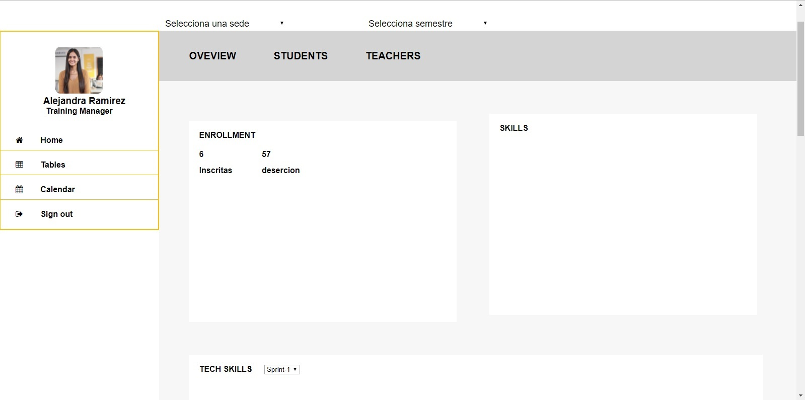

# Proyecto: Dashboard Laboratoria

## Descripción del Proyecto:

El siguiente repositorio contiene el desarrollo de un MVP, de un dashboard, con la información relevante de la estadística de Laboratoria y su data respecto al rendimiento de sus estudiantes y el de sus profesores.

## Procedimiento:

1. Primero se realizó un sketching del producto

2. Segundo, se realizó una entrevista a la Training Manager de Laboratoria Lima: Alejandra Ramirez, para conocer sus necesidades y requirimientos del producto.
Ella señaló que le era necesario tener la data del número de estudiantes actuales y que desertaron a primera mano. Así también un ranking del desempeño de sus profesores y la aprobación que Laboratoria obtiene como centro de enseñanza. También sugirió la implementación de un perfil de usuario visible.

3. La segunda persona entrevistada fue Franco Chamochumbi, encargado de Finanzas de Laboratoria; quien también indicó que tenía relevancia poder ver la cantidad de estudiantes actuales y el número de deserciones. Además poder filtrarlo por sede y generación.

4. Posteriormente se pasó a modificae el sketching de el producto, replicando las necesidades del usuario.

5. Desarrollo del maquetado.

6. Programación de funcionalidades.

## Herramientas utilizadas:

1. HTML5

2. CSS3

3. JS
