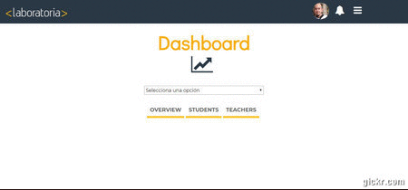
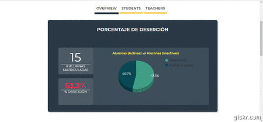

# Data Dashboard

* **OBJETIVO**
Construir una herramienta Web, donde se pueda analizar la mayor cantidad de datos posibles respecto al desempeño de las estudiantes de Laboratoria.

* **PROBLEMATICA**
Las TMs de Laboratoria no cuentan con una herramienta para revisar los documentos de excel (Google Spreadsheets) que están localizados en diferentes carpetas  y ubicaciones.
Esto ocasiona algunos problemas como:
-Pérdida de tiempo en localizar la información.
-Ejecutar fórmulas para obtener datos importantes.

* **REQUERIMIENTOS DEL USUARIO**
- Total de estudiantes presentes por sede y generación.
- Porcentaje de deserción de estudiantes.
- Cantidad de estudiantes que superan la meta de puntos en promedio de todos los  sprints.
- Porcentaje que representa el dato anterior en relación al total de estudiantes.
- El Net Promoter Score (NPS) promedio de los sprints cursados.
- Cantidad/Porcentaje que representa el total de estudiantes que superan la meta de puntos técnicos y por sprint.
- Cantidad/Porcentaje que representa el total de estudiantes que superan la meta de puntos de HSE  y por sprint.
- Puntuación promedio de l@s profesores.
- Puntuación promedio de l@s jedi masters.
- Representación gráfica de los datos.

* **ALCANCE**
- Se desarrolló una herramienta Web, que facilitará el manejo de la información de las estudiantes y egresadas de Laboratoria.
- La herramienta cuenta con los puntos siguientes:
- Amigable
- De fácil manejo

* **A continuación se muestra la navegación de la página**

