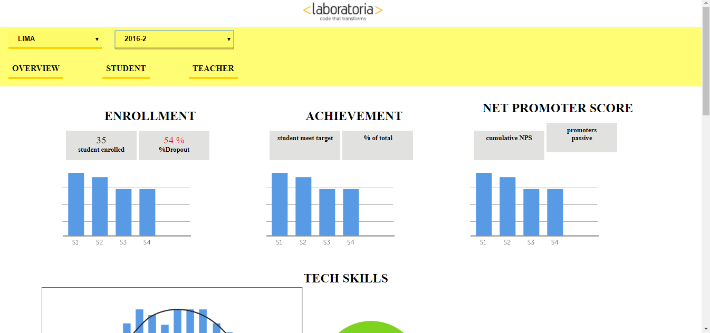

# Data Dashboard

## Producto Final : Data Dashboard

* El presente trabajo esta enfocado en poder proporcionar informacion recabada a lo largo de las generaciones de egresadas en Laboratoria desde el inicio de sus primeras graduadas.
* Las Training Managers (TMs) hacen un gran trabajo al analizar la mayor cantidad de datos posibles respecto al desempeño de las estudiantes para apoyarlas en su aprendizaje. Para revisar esta data, las TMs, normalmente, tienen que revisar muchos documentos de excel (Google Spreadsheets) que están localizados en distintas carpetas y ubicaciones. Muchas veces pierden tiempo localizando estos documentos y ejecutando fórmulas para obtener los datos que necesitan.

## Desarrollo:

1. El trabajo incorpora el diseño de maquetación con estructuras basicas empleadas a
tales como HTMLY CSS.

2. Crearemos diversar funcionalidades que permitiran un mejor desarrollo e integracion de la informacion.

3. Emplearemos la teoria desarrollada en clase tales como el manejo del DOM,
BOM ,crearemos eventos que permitiran un mayor flujo de la información.
4. El principal objetivo es integrar los datos academicos de las alumnas de Laboratoria.

