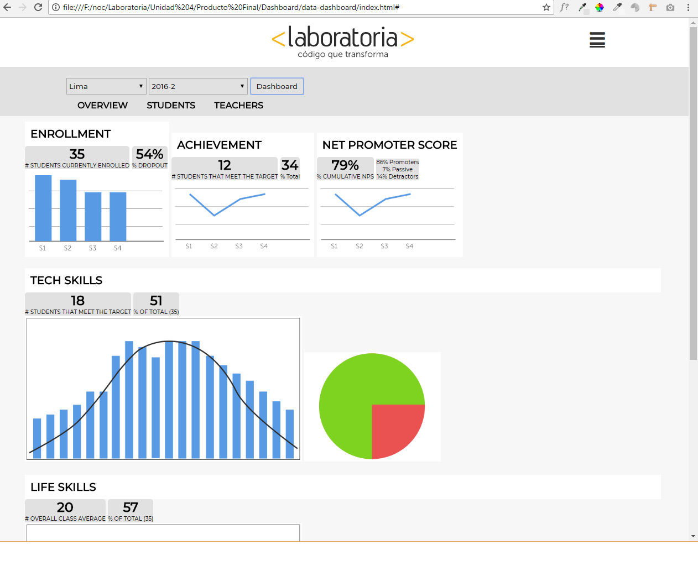

# Data Dashboard

* **Track:** _Common Core_
* **Curso:** _Creando tu primer sitio web interactivo_
* **Unidad:** _Producto final_

***

## Integrantes

* Longhi Valvede  
* Elizabeth Alcalá

### Introduccion:
El data-dashboard fue hecho para los profesores de laboratoria que nos han solicitado que construyamos una herramienta web donde puedan ver estos datos fácil y rápidamente.    
En base a los datos que nos solicitan:
* El total de estudiantes presentes por sede y generación.
* El porcentaje de deserción de estudiantes.
* La cantidad de estudiantes que superan la meta de puntos en promedio de todos los sprints cursados. La meta de puntos es 70% del total de puntos en HSE y en tech.
* El porcentaje que representa el dato anterior en relación al total de estudiantes.
* El Net Promoter Score (NPS) promedio de los sprints cursados. El NPS se calcula en base a la encuesta que las estudiantes responden al respecto de la recomendación que darían de Laboratoria, bajo la siguiente fórmula:

> [Promoters] = [Respuestas 9 o 10] / [Total respuestas] * 100
[Passive] = [Respuestas 7 u 8] / [Total respuestas] * 100
[Detractors] = [Respuestas entre 1 y 6] / [Total respuestas] * 100
[NPS] = [Promoters] - [Detractors]

* La cantidad y el porcentaje que representa el total de estudiantes que superan la meta de puntos técnicos en promedio y por sprint.
* La cantidad y el porcentaje que representa el total de estudiantes que superan la meta de puntos de HSE en promedio y por sprint.
* El porcentaje de estudiantes satisfechas con la experiencia de Laboratoria.
* La puntuación promedio de l@s profesores.
* La puntuación promedio de l@s jedi masters.
### Nuestra propuesta:

* Una columna en el lado derecho donde hay dos iconos uno de inicio y abajo el usuario.
Si pones en la casita aparece la pagina de inicio y si es el user aparece el perfil.
* Al costado esta una barra de toda la sedes de años anteriores y actual.Al seleccionar una de la serie y año muestra las estadisticas.
* las estadisticas estan se desliza hacia la izquierda mostrando toda la informacion.
* tenemos una menu donde sale estadisticas,promedios y estudiantes .
 
