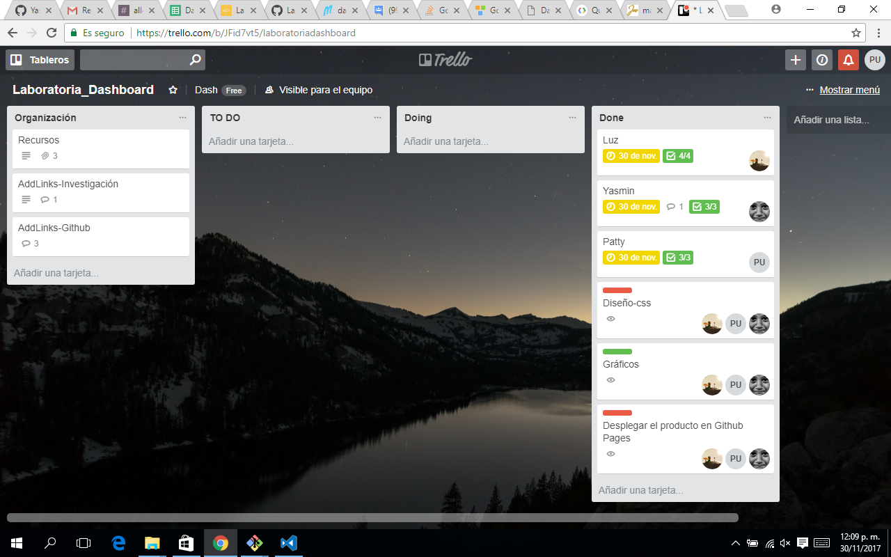
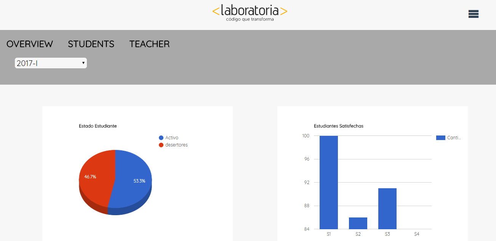

# **Data Dashboard**

* **Track:** _Common Core_
* **Curso:** _Creando tu primer sitio web interactivo_
* **Unidad:** _Producto final_

***

- ### **Objetivo**

    Construir una herramienta web que permita acceder a los datos del desempeño de las estudiantes en función a su Sede y Generación. 

- ### **Contenido**

    Los datos que muestra son:

    + El total de estudiantes presentes por sede y generación.
    + El porcentaje de deserción de estudiantes.
    + La cantidad de estudiantes que superan la meta de puntos en promedio de todos los sprints cursados. La meta de puntos es 70% del total de puntos en HSE y en tech.
    + El porcentaje que representa el dato anterior en relación al total de estudiantes.
    + El Net Promoter Score (NPS) promedio de los sprints cursados. El NPS se calcula en base a la encuesta que las estudiantes responden al respecto de la recomendación que darían de Laboratoria, bajo la fórmula que se muestra al final de esta sección.
    + La cantidad y el porcentaje que representa el total de estudiantes que superan la meta de puntos técnicos en promedio y por sprint.
    + La cantidad y el porcentaje que representa el total de estudiantes que superan la meta de puntos de HSE en promedio y por sprint.
    + El porcentaje de estudiantes satisfechas con la experiencia de Laboratoria.
    + La puntuación promedio de l@s profesores.
    + La puntuación promedio de l@s jedi masters.
    ~~~
    [Promoters] = [Respuestas 9 o 10] / [Total respuestas] * 100
    [Passive] = [Respuestas 7 u 8] / [Total respuestas] * 100
    [Detractors] = [Respuestas entre 1 y 6] / [Total respuestas] * 100

    [NPS] = [Promoters] - [Detractors]
    ~~~
        

- ### **Metodología de Trabajo**

    Para un óptimo trabajo en equipo se usó la herramienta Trello, mediante la cual se distribuyeron tareas, se realizaron coordinaciones y se establecieron metas claves a cumplir.

    

- ### **Resultado**

    

- ### **Recursos**

    <https://google-developers.appspot.com/chart/interactive/docs/quick_start>

