# Data Dashboard

#### Problemática actual.
##### Definición, delimitación y planeación.

Los integrantes del staff de Laboratoria dedican mucho de su tiempo en encontrar la data que necesitan para elaborar sus actividades, debido a la forma en que dicha data se encuentra organizada o quizá por la falta de organización de la misma.
En el siguiente documento se analizará la  forma en que se manipula, almacena y accede a la data dentro de Laboratoria, y a su vez se planteará una solución más efectiva.
  _Principalmente nos enfocaremos en encontrar y diseñar una herramienta para organizar la información relacionada con la interacción Staff-Alumnado para agilizar los procesos_

**Lluvia de ideas**
Los integrantes de este team (Navi, Lillys y Henie)por medio de una lluvia de ideas  llegamos a la conclución de que la problemática que enfrentamos se puede resolver si implementamos un módulo que sea parte del sitio de Laboratoria el cual nos permita manipular la data de manera sencilla, clara y fácil de usar.
### Hipótesis
Si creamos un módulo que sea parte del sitio web de Laboratoria, que permita acceder a la data y a su vez la organice y permita nutrirla, se maximizará el tiempo que se dedique a las actividades administrativas y a su vez permitirá claridad en los resultados.

### Objetivos
###### En este proyecto se engloban dos objetivos principales:
###### Primer Objetivo
> A nivel curricular el objetivo básico es poner en práctica lo aprendido en la unidad ** _"Creando un sitio web interactivo"_** _donde debemos incluir los conocimientos adquiridos sobre:_

* **Maquetado web** (_Con CSS y HTML_)
* **Creando funcionalidad** (_Con Java Script_)
* **User experience desing** (_Aplicando técnicas de UX y UI_)

###### Segundo Objetivo
>De acuerdo al proyecto, el objetivo principal de data-Dashboard es realizar un sitio web en el cual se pueda encontrar y accesar de manera facil, agil y organizada la data de Laboratoria para de esta forma poder optimizar el tiempo de las TMs y miembros del staff en cada sede.
Dentro de los datos que normalmente se requiere analizar encontramos:

1. El total de estudiantes presentes por sede y generación.
2. El porcentaje de deserción de estudiantes.
3. La cantidad de estudiantes que superan la meta de puntos en promedio de todos los sprints cursados. (La meta de puntos es 70%  del total de puntos en HSE y en tech.)
4. El porcentaje que representa el dato anterior en relación al total de estudiantes.
5. El Net Promoter Score (NPS) promedio de los sprints cursados.
6. La cantidad y el porcentaje que representa el total de estudiantes que superan la meta de puntos técnicos en promedio y por sprint.
7. La cantidad y el porcentaje que representa el total de estudiantes que superan la meta de puntos de HSE en promedio y por sprint.
8. El porcentaje de estudiantes satisfechas con la experiencia de Laboratoria.
9. La puntuación promedio de l@s profesores.
10. La puntuación promedio de l@s jedi masters.

***
### Investigación, análisis y empatía
>Con la finalidad de obtener la mayor cantidad de información sobre las espectativas del Data Dashboard y poder generar con nuestro nuevo sitio web la experiencia de usuario deseada, nos dimos a la tarea de entrevistar  directamente a los usuarios. Dentro de estos encontramos:
* TMs :
  * _Karla Rejas, GDL_
  * _Lucile Baratier, CDMX_
  * _Alejandra Ramirez, Lima_
  * _Valentina Smith, Santiago_
* Coachs:
  * _Yessenia Sanchez (Inti), GDL_
  * _Ameli Castillo (Meme), GDL_
  * _Levhita, GDL_
* HSE:
  * _Samantha Penilla, GDL_
* Alumnas GDL
  * Miriam Pérez
  * Lillys Hernández
  * Nadia Salazar

#### Fuentes de información
* [entrevista Sam](https://www.youtube.com/watch?v=j8vlV6c8IWg)
* [entrevista Meme](https://www.youtube.com/watch?v=vkNDiGRlch8&t=37s)
* [entrevista Karla]()
* [Entrevista Inti]()
* [Entrevistas TMs foraneas]()

Después de analizar la información recabada de estas entrevistas, encontramos que en la actualidad el método utilizado para accesar a la data que cada miembro del staff necesita se obtiene básicamente mediante encuestas y hojas excel que en su mayoría son generadas por ellos mismos o bien provienen de la base de datos de Laboratoria pero estas últimas sólo las recibe la TM de cada sede quien debe procesarla y unificarla para después compartir los datos que los coachs necesitan; este proceso es largo y tedioso debido a que todo viene en archivos separados y se debe empatar la información de cada alumna una por una.

**"Dedico mucho tiempo solo a organizar la data recibida en las hojas excel y además se recibe en archivos pesados y separados que requieren un equipo de cómputo más potente para trabajar; además se debe organizar todo antes de compartir con los Coachs en nuevos excel y eso a su vez nos consume mucho tiempo..."
(Karla Rejas,TM GDL)**

Los resultados de las alumnas sólo se reflejan hasta el final de cada sprint, lo cual complica el trabajo al hacer las retrospectivas y feedback.
Además, las alumnas no tienen acceso directo a sus resultados por lo cual deben solicitarlos a su coach quien debe realizar un proceso manual y largo para acceder a su data.

**Accedemos a la data por encuestas o excel y esta se filtra solo por generación, sede, código y spring pero a mi me gustaría que estuviera presentada por unidad para poder ver como van evolucionando a través del bootcamp y poder dar el feedback adecuado y detectar si necesitan ayuda a tiempo...(Meme, Coach GDL)**

**Nuestra Base de Datos actual solo incluye datos duros y no nos permite identificar de manera inmediata si alguna requiere asesoría mas personal o apoyo extra...(Inti, Coach  GDL)**

Actualmente no existe un sistema centralizador que permita conectar y actualizar de manera automatizada la información, esto además de complicar el proceso de análisis nos permite plasmar resultados de manera oportuna e inmediata y hace necesario que se repita un proceso de análisis manual cada vez que se debe acceder a cierta información.
Algo que debemos destacar es el hecho de que a pesar que los resultados de cada estudiante se obtienen de la suma de los resultados técnicos y los resultados de HSE, actualmenteno existe un formato que permita empatar los resultados de ambos:

**Me gustaría un espacio que me permita agregar a la Base de Datos las interacciones que tengo con las alumnas y poder medir si detrás de alguna mala nota existe alguna situación en su vida que esté afectando su desempeño... (Sam,  GDL)**

Si la organización y análisis manual de la información se automatizara mediante un proceso, el tiempo que los miembros del staff emplean en esta actividad se reduciría considerablemente y permitiría aumentar el desempeño y satisfacción laboral.

*Actualmente no se miden parámetros importantes en la Base de Datos actual por ejemplo:*

1. Desempeño por tema y/o unidad por alumna, generacion y sede.
2. Nivel de aprovechamiento de los recursos y apoyos extracurriculares tales como cursos y charlas.
3. Compromiso y desempeño vs Problemáticas personales.
***
Los usuarios entrevistados mencionaron los siguientes puntos importantes a desarrollar:

 **Cubriendo necesidades**

En la actualidad | Data Dashboard deseado
-----------------|-----------------------
Se accede a la data por medio multiples archivos de hojas de exel|Accede a la data organizada en un solo lugar
El tiempo de búsqueda y acceso a la data es largo|Un menú ágil y específico permite acceder rápidamente a la data
La TM es quien en primer instancia recibe la data , la organiza y distribuye en cada sede|Todos pueden ingresar a la Base de Datos y recopilar y/o analizar la data necesaria y/o solicitada de acuerdo a su perfil(TMs,HSE, Coach,Alumna)
Cada proceso para organizar la data recabada se hace de forma manual|La nueva web de Data Dashboard automatizará el análisis y organización de la data
Si alguna alumna/estudiante requiere saber sobre su desempeño debe recurrir a su jedi o profesor para obtener sus resultados|Cada alumna/estudiante tendrá acceso a sus resultados en todo momento accediendo con su código
Todo lo relacionado con HSE se procesa en una Base de Datos distinta y dificulta su análisis con la parte técnica|Dentro de cada perfil encontraremos un apartado de HSE que estará enlazado con los resultados técnicos para facilitar el proceso de análisis y calificaciones finales.
No se cuenta con un medidor de aprovechamiento detallado|De manera clara y de fácil acceso podemos acceder a gráficas de aprovechamiento por sede, generacion ,alumna, unidad y tema.
El proceso para las deserciones es complicado y externo, el proceso es confuso y no queda en cierta forma archivado con el resto de la data y sus causas|Cada perfil contará con un apartado que incluye un proceso claro para generar una baja en caso necesario y esta información quedará registrada en nuestro data Dashboard

## Propuesta
### Pseudocódigo
1. Generar una página de inicio principal con imágen de fondo, datos básicos del data Dashboard y un login que especifique el tipo de usuario(Tms, Coachs, HSE, Alumnas).
2. Pintar el nombre de usuario y desplegar menú de opciones (sede, generación y especificaciones por tipo de usuario ya que dependiendo del perfil se definirá a que data necesita tener acceso).
3. Caso "1" Usuario TMs:
  * Menú:
    * Overview (Página Principal)
    * Sede
      * Generación
        * Jedi (Despliega información y evaluaciones así como input para ingresar data - comentarios- retroalimentación- compromisos-mas)
        * Profesores (Despliega información y evaluaciones así como input para ingresar data - comentarios- retroalimentación- compromisos-mas)
        * Alumnos (Despliega perfil de ingreso- historia-trayecto-resultados-gráficas comparativas de evolución-botón de deserción que redirige a un "form" y este guarda la data ingresada para futuras estadísticas).
        * NPS(El Net Promoter Score (NPS) promedio de los sprints cursados. El NPS se calcula en base a la encuesta que las estudiantes responden al respecto de la recomendación que darían de Laboratoria, bajo la siguiente fórmula:

[Promoters] =  [Respuestas 9 o 10] / [Total respuestas] * 100
[Passive] =    [Respuestas 7 u 8] / [Total respuestas] * 100
[Detractors] = [Respuestas entre 1 y 6] / [Total respuestas] * 100

[NPS] = [Promoters] - [Detractors])
            * Aprovechamiento(individual y generacional tanto por unidad , tema y sprints).
            * Individual(tema a tema con imputs para comentarios).
            * Generacional.
            * Deserción
4. Caso "2" Coachs
* Menu: Sede - Generación.
    * Ingresar Data(comentarios-resultados-datos sobresalientes...).
    * Obtener Data.
      * Trabajos entregados.
      * Asistencias.
      * Resultados de:
        * Spring.
        * Unidad.
        * Tema.
        * Extracurriculares.

5. Caso "3" HSE:
    * Menú (Sede-Generación).
      * Asistencias.
      * Interacciones(Con opción de review y de ingresar data).
      * Aprovechamiento(Por tema-unidad-sprints).
      * Deserción(form).

6. Caso "4" Alumnas:
      * Menú:
        * Perfil (overview).
        * Skills.
        * Desempeño.
        * Contacto.

*App y versión web **Se inicia con la versión caso 1 y posteriormente se implementarán las versiones necesarias para cubrir el total de los casos**
***
## Sketching y Prototyping
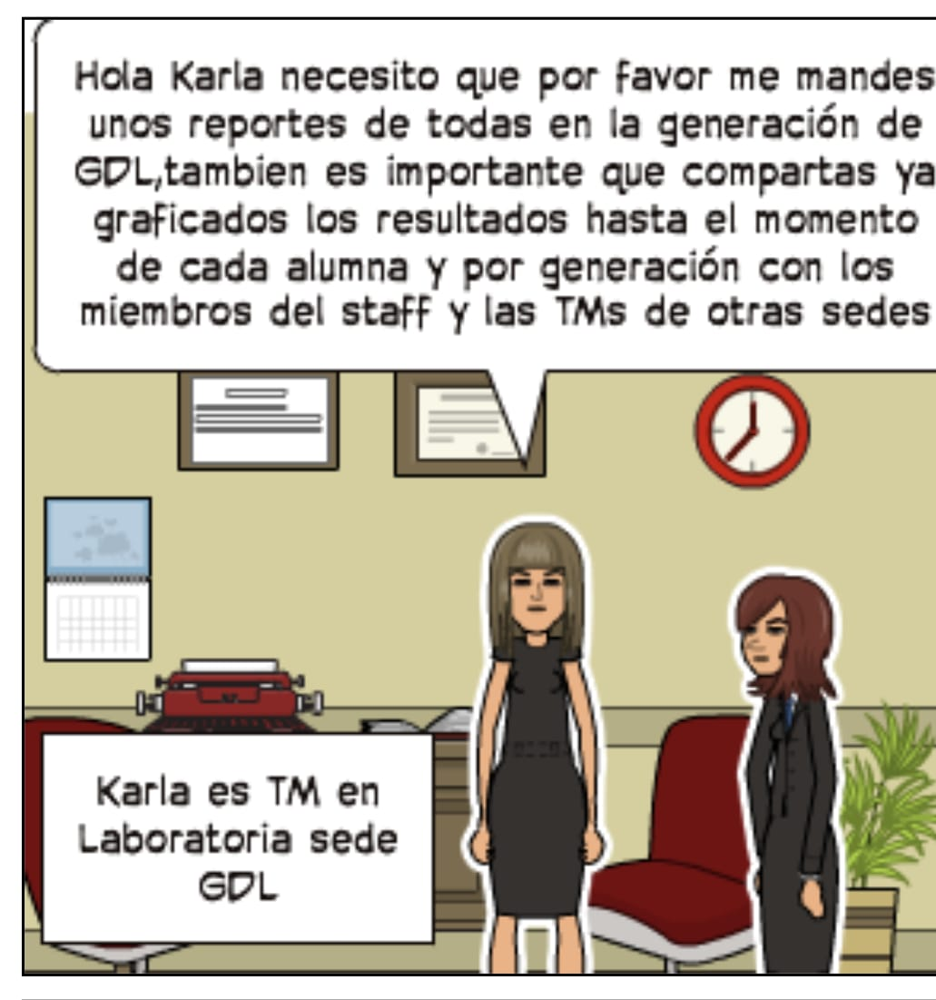
***
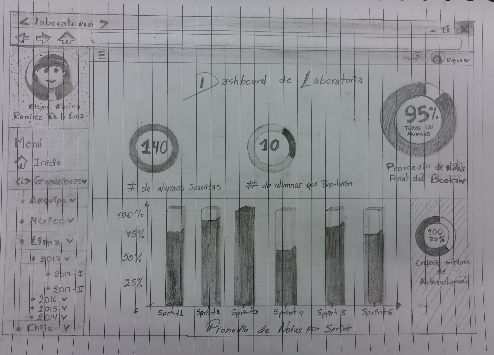
***
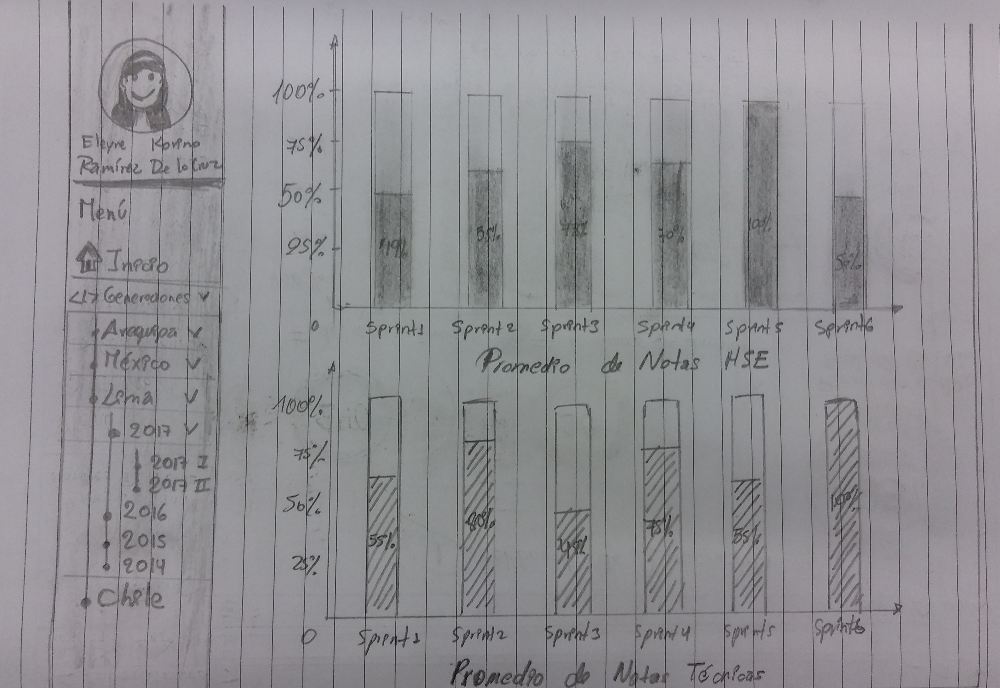
***
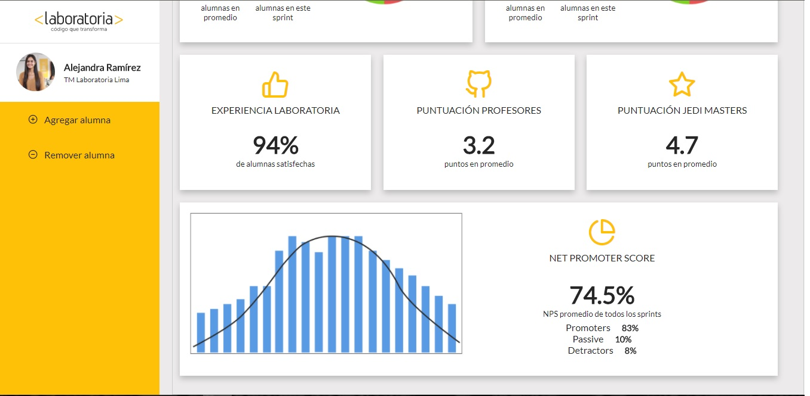
***
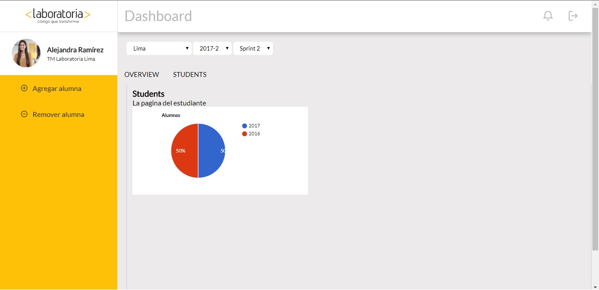
***
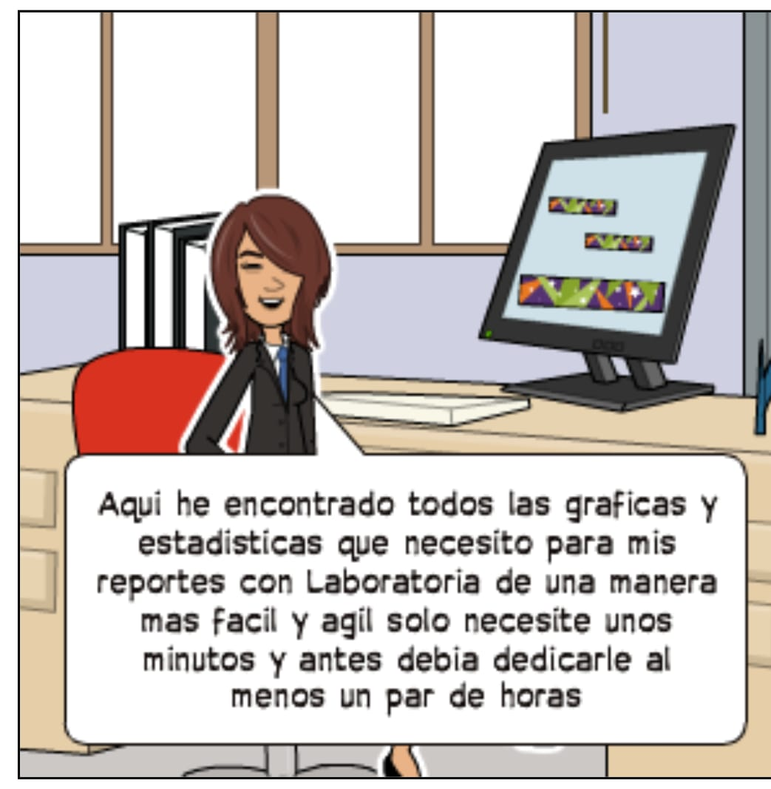
***
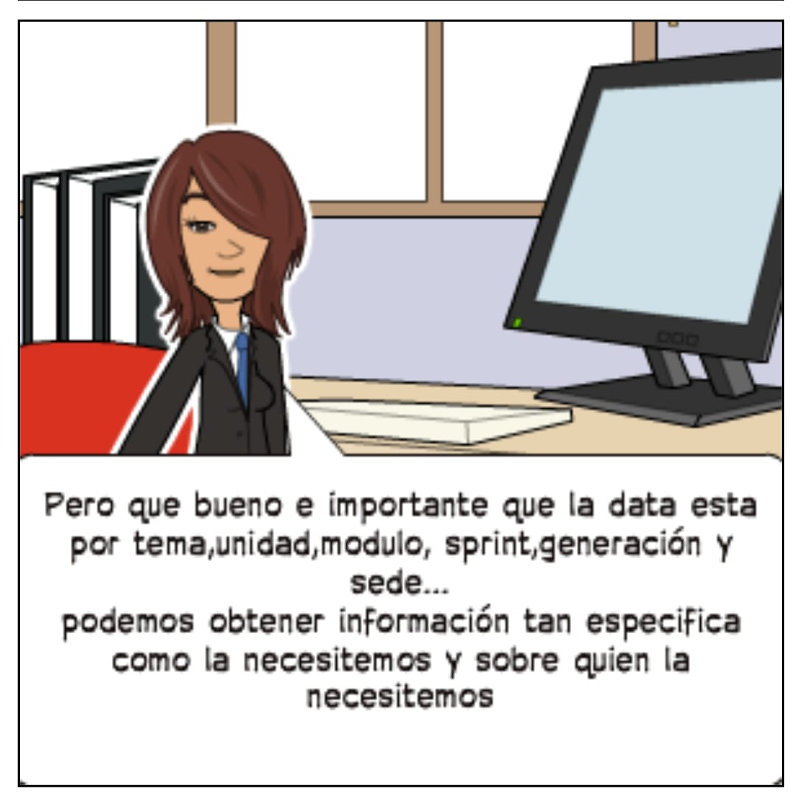
***

### Flujo

### Primer Sketcher para determinar secuencia de interacciones:
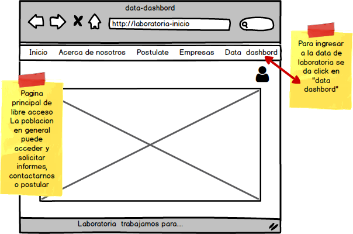
***
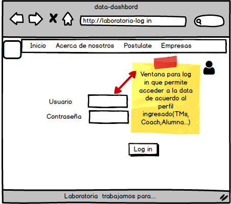
***
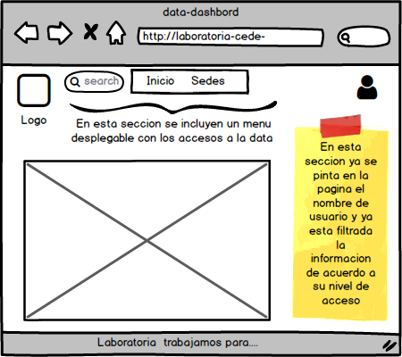
***
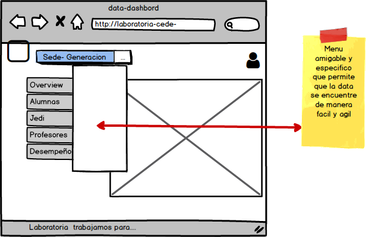
***
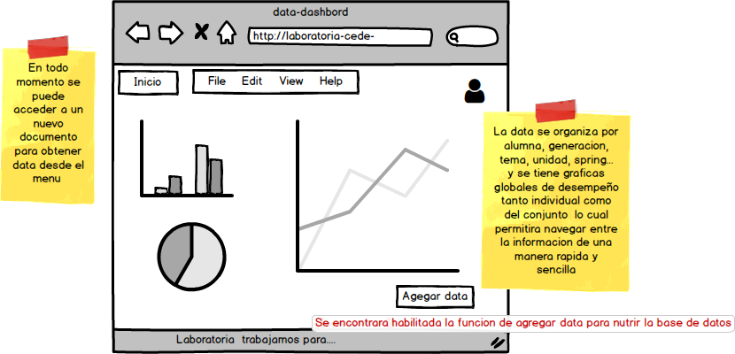
