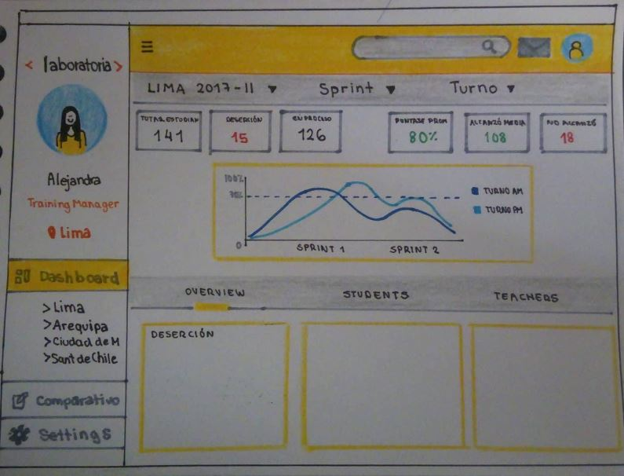

# Data Dashboard

* **Track:** _Common Core_
* **Curso:** _Creando tu primer sitio web interactivo_
* **Unidad:** _Producto final_

***

## Flujo de trabajo

1. Debes realizar un [**fork**](https://gist.github.com/ivandevp/1de47ae69a5e139a6622d78c882e1f74)
   de este repositorio.

2. Luego deberás **clonar** tu fork en tu máquina. Recuerda que el comando a usar
   es `git clone` y su estructura normalmente se ve así:

   ```bash
   git clone https://github.com/<nombre-de-usuario>/freelancer.git
   ```

3. Cuando hayas terminado tu producto, envía un Pull Request a este repositorio
   (puedes solicitar apoyo de tus profes para este paso).

> Nota: No olvides que es una buena práctica describir tu proyecto en este
> archivo `README.md` y también desplegar tu web a Github Pages :smiley:.

## Objetivos del reto

El reto consiste en:

* Crear propuesta para optimizar el tiempo de las TMs para poder visualizar los datos más rápidamente. Los datos serían: 
  * El total de estudiantes presentes por sede y generación.
  * El porcentaje de deserción de estudiantes.
  * La cantidad de estudiantes que superan la meta de puntos en promedio de todos los sprints cursados. La meta de puntos   es 70% del total de puntos en HSE y en tech.
  * El porcentaje que representa el dato anterior en relación al total de estudiantes.
  * El Net Promoter Score (NPS) promedio de los sprints cursados. El NPS se calcula en base a la encuesta que las estudiantes responden al respecto de la recomendación que darían de Laboratoria, bajo la siguiente fórmula:

   [Promoters] = [Respuestas 9 o 10] / [Total respuestas] * 100
   [Passive] = [Respuestas 7 u 8] / [Total respuestas] * 100
   [Detractors] = [Respuestas entre 1 y 6] / [Total respuestas] * 100

   [NPS] = [Promoters] - [Detractors]

* Sustentar tu propuesta y recolectar feedback.
* Elegir tareas del backlog que creas que puedas completar durante el reto.
* Crear plan de acción en pareja.
* Documentar propuesta y plan de acción en el `README.md`.
* Implementar la página usando `HTML`, `CSS` y `JS`.
* Desplegar la página en GitHub pages.

## Agenda

### Día 1

1. Presentación del producto final. (20 minutos)
2. Asignación de parejas.
3. Creación de un plan en parejas: Estimación de tiempo/tareas y decidir si incluir algo
   del backlog (10min)
4. Iniciar **implementación** y adaptar plan según sea necesario
5. **Sketching**: Armar una propuesta y recolectar feedback (20min).


## Consideraciones

* Encontramos un archivo base `index.html` en el cual debemos escribir la
  estructura de nuestro proyecto, enlazar el archivos CSS y también el archivo JS.

* En la carpeta `css` encontramos un archivo base `main.css` donde agregaremos los
  estilos necesarios de nuestro proyecto.

* Dentro de la carpeta `assets` se encuentramos la carpeta `images` donde
  encontramos todas las imágenes necesarias para completar nuestro proyecto.

* **Actualizamos el archivo `README.md`** explicando nuestra propuesta y plan
  de acción.

* Utilizamos la paleta de colores característica de Laboratoria : `#ffc107`, `#eee` y `#2b2b2b`.

* Los íconos de redes sociales los obtuvimos de [Font Awesome](http://fontawesome.io/) y [Icomoon](https://icomoon.io/).

* Para este reto, necesitamos descubrir como manejar la data que nos brindaron. 

## Backlog

* Poder mostrar los datos procesados en un gráfico como el diseño de ejemplo propone u otra alternativa.

* Tener un botón que permita indicar que una estudiante ha salido del Bootcamp y alterar los totales afectados por este cambio.

## Plan de acción

### Para el sketching 

  * Fusionar ideas de nuestros sketchings personales y crear uno en común.
  * Testear nuestro prototipado.
  * Hacer mejoras según el testeo.
  
  * Prototipo de alta fidelidad :
    

### Para el maquetado

  * Comenzar a maquetar en base a nuestro prototipo.

### Para manejar la data 

  * Buscar inforación sobre cómo manejarla.

### Para agregar backlog

  Escogimos las siguientes:

  * Añadir los gráficos.


## Tiempos estimados

* Para el sketching y maquetado: *1 día.*

* Para manejar la data: *2 días.*

* Para agregar backlog: *hrs.*