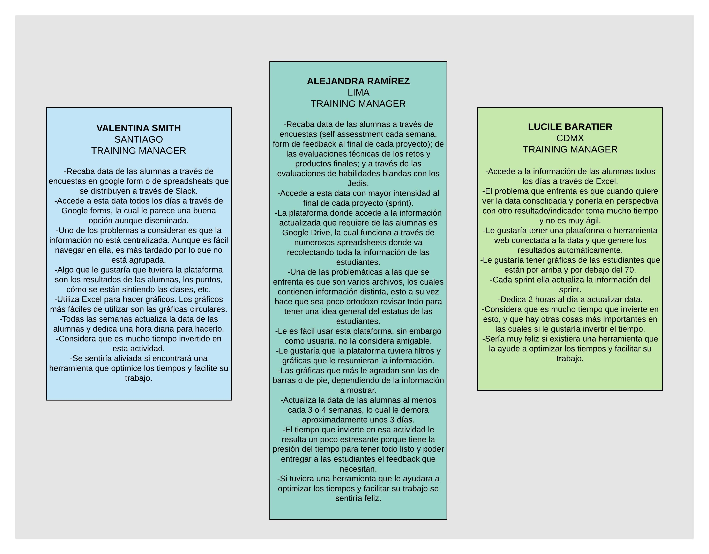

# **DATA DASHBOARD**

El dashboard es una herramienta utilizada por profesores, training managers, directores y gerentes de Laboratoria para ver rápidamente qué está pasando en el salón de clases de Laboratoria. En el dashboard, los usuarios mencionados pueden ver rápidamente estadísticas y datos en tiempo real como:
+ Número de alumnas inscritas
+ Número de alumnas que desertaron
+ Número y porcentaje de alumnas que pasan el criterio mínimo de evaluación.
+ Promedio de notas por sprint
+ Promedio de notas HSE
+ Promedio de notas técnicas

Además, dado que Laboratoria tiene muchas generaciones, regularmente 2 generaciones por año (estas generaciones empezaron en el 2014), y que opera en 5 sedes (Guadalajara, Ciudad de México, Lima, Santiago de Chile y Sao Paulo), es posible que los usuarios quieran ver datos de sedes / generaciones anteriores para poder hacer comparaciones.

## INVESTIGACIÓN Y EMPATÍA

### ENTREVISTAS
Se llegó al acuerdo de que todo el grupo (la primera generación de la sede de GDL) hiciera una lista de preguntas base para después entrevistar a las Training Managers de las diferentes sedes, las dos coaches y la psicóloga de la sede de Guadalajara, y de esa forma todas tendríamos la misma información y ya cada equipo se encargaría de dar su planteación del problema y la oferta de soluciones.

Las entrevistas realizadas en la sede de GDL fueron en vivo, por lo cual se pudieron grabar en vídeo. Lo contrario a las entrevistas para las Training Managers de las diferentes sedes, que colaboraron de forma escrita.

+ [Entrevista a Karla Rejas - Training Manager](https://www.youtube.com/watch?v=ydkRl33TN0g)
+ [Entrevista a Yesenia Sánchez - Coach](https://www.youtube.com/watch?v=WfA5FjN4rFQ&t=1s)
+ [Entrevista a Ameli Castillo - Coach](https://www.youtube.com/watch?v=vkNDiGRlch8&t=8s)
+ [Entrevista a Samantha Penillo - Psicóloga](https://www.youtube.com/watch?v=j8vlV6c8IWg)

### RESULTADOS DE ENTREVISTAS

### DESCUBRIMIENTOS

Se propone una aplicacion amigable tipo **Dashboard** dirigido a las **Training Managers** la cual les permita monitorear a cada una de las coders inscritas en **LABORATORIA** en cada una de las sedes  (Arequipa, Lima, Guadalajara, CDMX, Santiago de Chile y Sao Paulo).
para esto se relizaron una serie de entrevistas.  

## Descripcion:
cada Training manager tendra un usuario y contrase;a lo cual permitira hacer el **Dashboard** mas personalizado.
al ingresar podra seleccionar la sede
