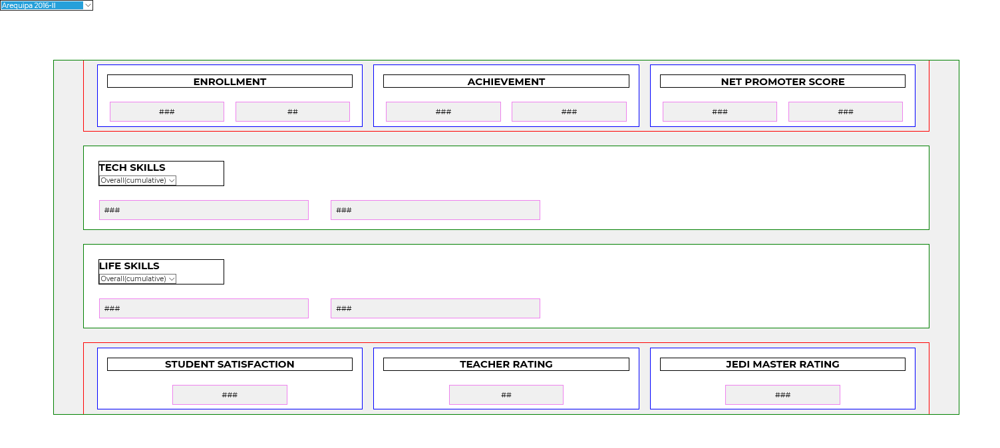

# Data Dashboard

* **Unidad:** _Producto final_

***
## Squad AukaCoders 
* Victoria Lung
* Isabelle Chávez
* Edith Jurado
* Nathaly Otero Celis
* Ada Yajahuanca
* Annie Gutierrez 
* Vanessa Colqui 
* Maria Cristina Ortiz 
* Pamela Rojas 
***

## Descripción General
Es una representación gráfica de los indicadores clave (KPI) que intervienen en la consecución de los objetivos de negocio(Laboratoria), y que está orientada a la toma de decisiones para optimizar la estrategia de la empresa. Un dashboard debe transformar los datos en información y que estos estén en conocimiento para el negocio(Laboratoria).

## Objetivo

Construir una herramienta web donde las **TMs** de Laboratoria puedan ver los datos de manera fácil y rápida con respecto al desempeño de las estudiantes,  para poder analizarlos,  posteriormente emitir conclusiones, y así poder apoyar a las alumnas en su aprendizaje. Estos son los datos(indicadores Kpi) que revisan normalmente, los cuales debemos mostrarlos brevemente, con una representación gráfica adecuada (ordenado y limpio) para que se pueda visualizar, contextualizar y comparar los datos :

* El total de estudiantes presentes por sede y generación.
* El porcentaje de deserción de estudiantes.
* La cantidad de estudiantes que superan la meta de puntos en promedio de todos los sprints cursados. La meta de puntos es 70% del total de puntos en HSE y en tech.
* El porcentaje que representa el dato anterior en relación al total de estudiantes.
* El Net Promoter Score (NPS) promedio de los sprints cursados.
* La cantidad y el porcentaje que representa el total de estudiantes que superan la meta de puntos técnicos en promedio y por sprint.
* La cantidad y el porcentaje que representa el total de estudiantes que superan la meta de puntos de HSE en promedio y por sprint.
* El porcentaje de estudiantes satisfechas con la experiencia de Laboratoria.
* La puntuación promedio de las profesores.
* La puntuación promedio de las jedi masters.

## Desarrollo

ETAPAS DEL DESARROLLO DEL PRODUCTO:

* **ETAPA UNO: DISEÑO DE LA EXPERIENCIA (UX UI)**

 A partir de la necesidad de las TMs de Laboratoria de analizar datos de una manera más sencilla y práctica, nació como alternativa de resolución del problema la idea de desarrollar un **Dashboard** que simplifique dicha tarea mediante la presentacion de gráficos y datos(indicadore KPI) concisos y precisos. Para ello se hizo lo siguiente:

 - Elaboración de Sketch (prototipo sencillo) sobre de la herramienta web(**dashboard**).

  

 **ETAPA DOS: DESARROLLO (Frond end y Back End)**

  Etapa de elaboración del producto en código. Se realizó lo siguientes:

   -  Se creó un Archivo HTML donde figura: **header** (logo de laboratoria), **nav** ( barra de navegación: sedes y generaciones (contenida en una etiqueta **selection. my-select** a quien se le aplicará el EVENTO UNO: CHANGE), students y teachers),  **section. dispplay-none** (Se encuentra toda la información concerniente a los indicadores solicitados a mostrar. Dicha sección se encuentra con la propiedad ** display: none** para que cuando apliquemos en el evento **change** a la etiqueta selection ** SEDE Y GENERACIONES**,  aparezca la section. También se encuentra los filtros para TECH SKILLS y LIFE SKILLS a quien se les aplicara el EVENTO DOS:CHANGE ).

   - Se creó un archivo **main.css** donde se encuentran todos los estilos aplicados a todas la partes del body del documento HTML. No hubo la necesidad de crear estilos para los eventos ya que no se creo ningun elemento en el DOM.

   - Se creó dos archivo **javascript** : **"app.js"** donde se encuentran todos los eventos aplicados ( _change_ ) a la etiqueta **select. my-select** que se encuentra en la etiqueta **nav**, a las etiquetas **select.select-sprint-life** y **select.select-sprint-tech**  que se encuentran en la etiqueta **section. display-none**; y el archivo  **graphic.js** donde se encuentran las funciones generales(globales) de las gráficas ingresadas utilizando la herramienta **"chart google"** las cuales son llamadas en los eventos aplicados en **app.js**.

  **ETAPA TRES: CRECIMIENTO**

  En esta etapa se probará el producto desarrollado para recibir feed back y seguir mejorandolo para que siga cumpliendo mejores expectativas.

 - Testeo del producto para modificar o agregar cambios según la necesidad de las TMs: 
 
 
   
   
   
  **Feedback de TMs Lulú Vilchez:**
  
  * Enfocarnos en la obtención de datos de la sede Lima y las tres generaciones que la componen.
  
  **Cambios a aplicar:**

  * Adición de la data de todas las sedes (Arequipa, Santiago de chile y México) faltantes y sus generaciones respectivas.
  
   ***
