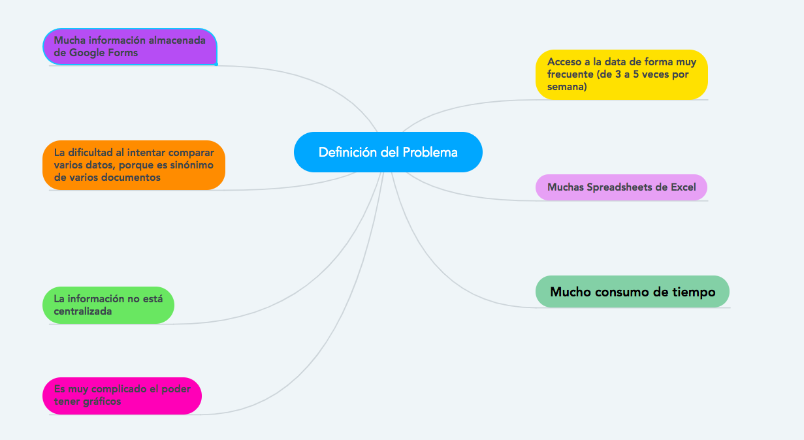
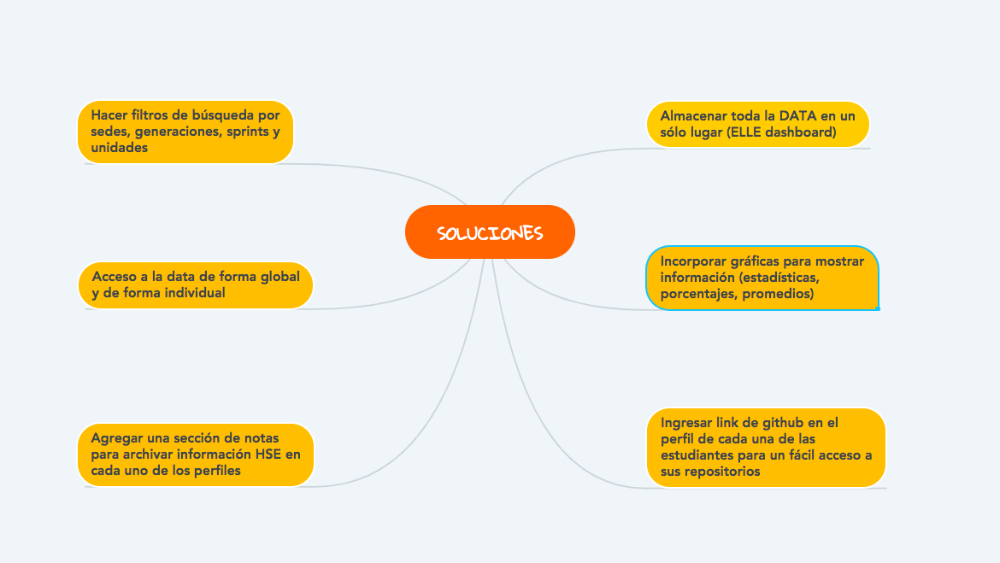

# **DATA DASHBOARD - ELLE**

+ **Alumnas** : Ada Ramírez y Orquídea Campos
+ **Unidad** : 4 DATA DASHBOARD

El dashboard es una herramienta utilizada por profesores, training managers, directores y gerentes de Laboratoria para ver rápidamente qué está pasando en el salón de clases de Laboratoria. En el dashboard, los usuarios mencionados pueden ver rápidamente estadísticas y datos en tiempo real como:
+ Número de alumnas inscritas
+ Número de alumnas que desertaron
+ Número y porcentaje de alumnas que pasan el criterio mínimo de evaluación.
+ Promedio de notas por sprint
+ Promedio de notas HSE
+ Promedio de notas técnicas

Además, dado que Laboratoria tiene muchas generaciones, regularmente 2 generaciones por año (estas generaciones empezaron en el 2014), y que opera en 5 sedes (Guadalajara, Ciudad de México, Lima, Santiago de Chile y Sao Paulo), es posible que los usuarios quieran ver datos de sedes / generaciones anteriores para poder hacer comparaciones.

---
## DESCRIPCIÓN:
En este proyecto final nuestro objetivo es crear un dashboard, el cual permita monitorear a cada una de las coders inscritas en LABORATORIA en las diferentes sedes ubicadas en Lima, Guadalajara, CDMX, Santiago de Chile y Sao Paulo. 

Decidimos nombrar a nuestro dashboard **ELLE**, el cual es un nombre femenino que se deriva del francés "elle" que significa "ella". También nos gustó que **ELLE** se pronuncia como la "L" en inglés, haciendo alusión a la L de **LABORATORIA**. En otras palabras, podemos decir que cada que digamos ELLE estamos diciendo: *"Ella de Laboratoria"*. 

**ELLE** tendrá un acceso exclusivo para personal de Laboratoria, por lo cual cada uno tendrá un nombre de usuario y una contraseña. Una vez dentro, ELLE mostrará un mapa que señalará las diferentes sedes existentes para que el usuario pueda dar un click a la sede de su preferencia. ELLE pretende solucionar los problemas detectados en las entrevistas realizadas, para así agilizar el sistema de evaluación.

---
## INVESTIGACIÓN Y EMPATÍA

### ENTREVISTAS
Se llegó al acuerdo de que todo el grupo (la primera generación de la sede de GDL) hiciera una lista de preguntas base para después entrevistar a las Training Managers de las diferentes sedes, las dos coaches y la psicóloga de la sede de Guadalajara, y de esa forma todas tendríamos la misma información y ya cada equipo se encargaría de dar su planteación del problema y la oferta de soluciones.

Las entrevistas realizadas en la sede de GDL fueron en vivo, por lo cual se pudieron grabar en vídeo. Lo contrario a las entrevistas para las Training Managers de las diferentes sedes, que colaboraron de forma escrita.

##### VIDEOS
+ [Entrevista a Karla Rejas - Training Manager](https://www.youtube.com/watch?v=ydkRl33TN0g)
+ [Entrevista a Yesenia Sánchez - Coach](https://www.youtube.com/watch?v=WfA5FjN4rFQ&t=1s)
+ [Entrevista a Ameli Castillo - Coach](https://www.youtube.com/watch?v=vkNDiGRlch8&t=8s)
+ [Entrevista a Samantha Penillo - Psicóloga](https://www.youtube.com/watch?v=j8vlV6c8IWg)

##### DOCUMENTOS
+ [Entrevista a Lucile Baratier - Training Manager](https://drive.google.com/file/d/1JmAgYQDO-EoXYTXVZyoWlXiQ4127uhG1/view?usp=sharing)
+ [Entrevista a Alejandra Ramírez - Training Manager](https://drive.google.com/file/d/1ZjuKCBd-cjiM36zriaPxnZ5HfovUXw5D/view?usp=sharing)
+ [Entrevista a Valentina Smith - Training Manager](https://drive.google.com/file/d/1Xwq1qGKpPJXU144_uooemkn_Jq-kUYvu/view?usp=sharing)

### RESULTADOS DE ENTREVISTAS

### DESCUBRIMIENTOS

Gracias a las entrevistas pudimos localizar varios factores en común, como por ejemplo: mucha inversión de tiempo, el uso constante tanto de documentos Excel como de Google Forms, ya sea para recolectar como para clasificar información. También pudimos notar las perspectivas únicas dependiendo la labor que cada una desempeña, por ejemplo, la psicóloga Sam Penillo considera vital la implementación de una sección de notas para cada perfil para que de ésta forma se pueda mantener un mejor registro de sus habilidades blandas (HSE). Algo muy importante es que todas las participantes (futuras usuarias) estarían dispuestas y contentas de usar un producto que las ayude a agilizar los procesos de su desempeño laboral.

---
## DEFINICIÓN

### HIPÓTESIS
Aunque Excel y Google Forms han sido el común denominador para organizar y accesar a la información de las estudiantes de **Laboratoria**, no son la opción más óptima o más deseable de las usuarias debido a que el contenido no está almacenado en una misma fuente, sino que por el contrario se dividen en múltiples documentos, haciendo que el proceso del análisis de la data sea más tardado y por consecuencia más tedioso. Por eso al crear un Dashboard amigable que contenga toda la información en un sólo lugar para que que puedan monitorear a cada una de las coders inscritas en **LABORATORIA** va a  garantizar su uso y un feedback positivo.

### PROBLEMA PRINCIPAL
Las usuarias, principalmente las Training Managers coinciden en que aunque hasta ahora han podido desempeñar un seguimiento y buena organización de la data a través de Excel y Google Forms, el proceso de hacerlo no es el más factible ya que les consume mucho tiempo que podrían dedicar a otras responsabilidades. 

### LLUVIA DE IDEAS
#### DEFINICIÓN DEL PROBLEMA

---

## IDEACIÓN
#### PROPUESTAS DE SOLUCIONES

---

## SKETCHING Y PROTOTYPING

#### HISTORIA DE USUARIO

#### SKETCH DEL FLUJO DE LA APLICACIÓN

---
