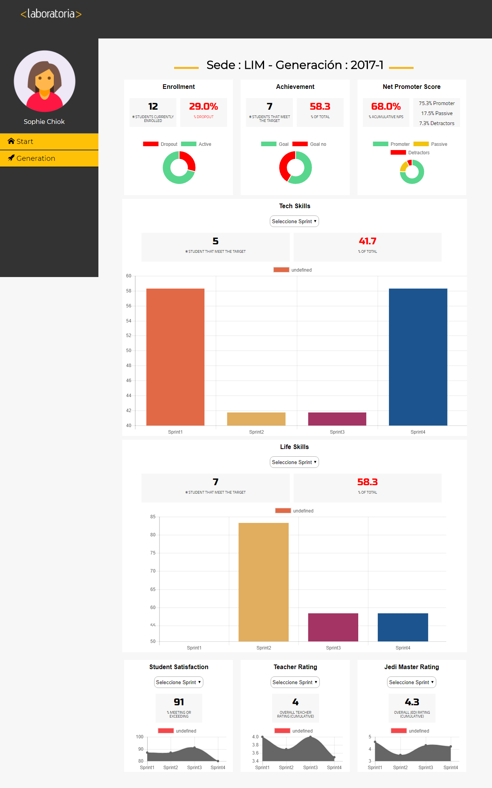

# Data Dashboard

* **Track:** _Common Core_
* **Curso:** _Creando tu primer sitio web interactivo_
* **Unidad:** _Producto final_

## Objetivo
Es crear un web interactiva, de complejidad media, que muestre los datos y el perfil de una estudiante de Laboratoria.

## Pasos Adicionales

* Se realizó el UX de la web
* Se maquetado
* Se programo su interacción con JavaScript

### Requerimientos

* El total de estudiantes presentes por sede y generación.
* El porcentaje de deserción de estudiantes.
* La cantidad de estudiantes que superan la meta de puntos en promedio de todos los sprints cursados. La meta de puntos es 70% del total de puntos en HSE y en tech.
* El porcentaje que representa el dato anterior en relación al total de estudiantes.
* El Net Promoter Score (NPS) promedio de los sprints cursados. 
* La cantidad y el porcentaje que representa el total de estudiantes que superan la meta de puntos técnicos en promedio y por sprint.
* La cantidad y el porcentaje que representa el total de estudiantes que superan la meta de puntos de HSE en promedio y por sprint.
* El porcentaje de estudiantes satisfechas con la experiencia de Laboratoria.
* La puntuación promedio de l@s profesores.
* La puntuación promedio de l@s jedi masters.

 

- Dentro de la carpeta `assets` se encuentra la carpeta `images` donde encuentra todas las imágenes necesarias para completar el producto final.

    ```bash
    https://carlacentenor.github.io/data-dashboard/
     ```

***
Equipo:
* Carla Patricia Centeno Ramos.
* Eleyne Karina Ramírez De la Cruz.